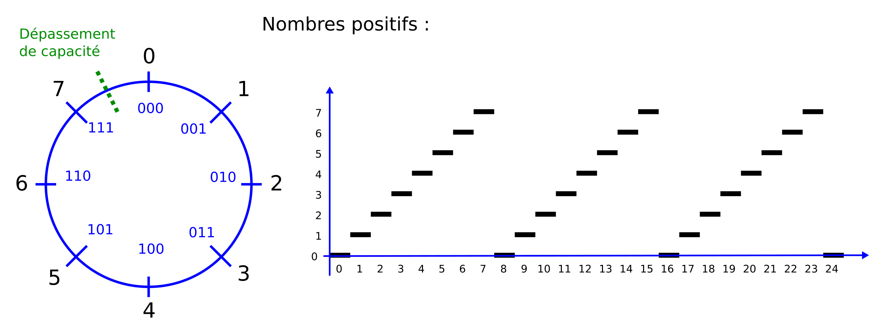
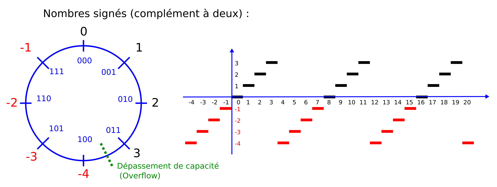
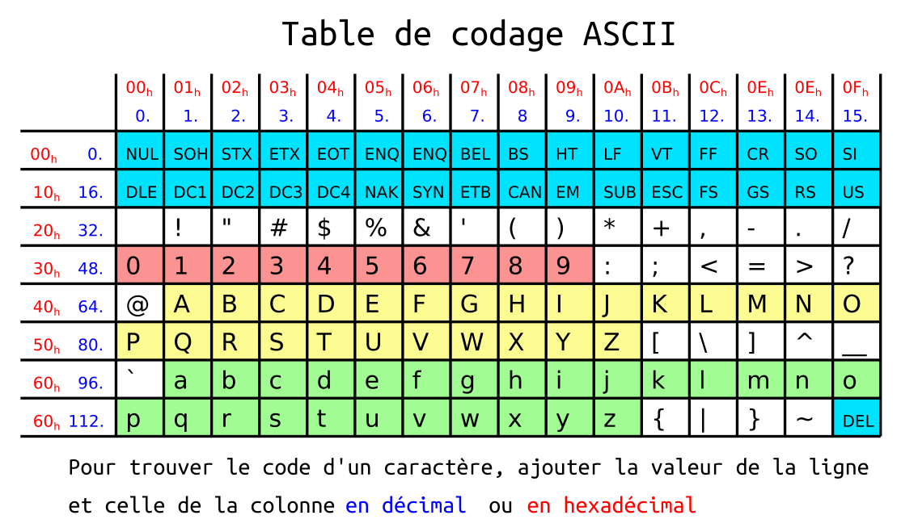

% Nombres et champs de bits
% [Pierre-Yves Rochat](mailto:pyr@pyr.ch), EPFL et [Yves Tiecoura](mailto:tiecouray@yahoo.fr), INP-HB
% rév 2015/12/25

> Ce document n’est pas à jour, il n’a pas encore été adapté aux modifications des diapositives pour la vidéo.

## Bascules et registres ##

Une LED peut être, à un instant donné, complètement éteinte ou allumée à un degré d’intensité ajustable. Cet état est généralement mémorisé par une bascule.

Les enseignes et afficheurs à LED utilisent beaucoup de registres, composés de bascules. Ces registres sont souvent de 8 bits ou de 16 bits, mais on en trouve aussi avec des valeurs beaucoup plus grandes.

L’état de chaque LED est aussi fréquemment mémorisé dans la mémoire d’un microcontrôleur. Le processeur du microcontrôleur reçoit des données, il les traite et diffuse les résultats sur ses sorties. Tous les systèmes informatiques travaillent en binaire. Historiquement, des systèmes ternaires (fonctionnant en base 3) ont été développés, mais ils sont extrêmement rares et pratiquement introuvables sur le marché.

....

## Champ de bit ##

On appelle “_bit_” un symbole binaire. Il peut prendre les valeurs _0_ et _1_, qui peuvent aussi s’appeler _vrai_ et _faux_, _allumé_ et _éteint_, etc. C’est un mot-valise composé de la fusion des mots de la locution anglaise _binary digit_ ou _chiffre binaire_ en français.

On désigne par mot binaire, ou champ de bits, un ensemble de bits. Des opérations logiques peuvent s’appliquer à ces champs de bits (NON, ET, OU, etc.). Elles seront étudiées plus loin dans ce cours.

## Nombres binaires ##

Un champ de bit peut aussi représenter un nombre. La numération binaire est bien connue :

Figure : Numération binaire

... poids...

Par exemple, 2345 (en décimal) s’exprime par 100100101001 en nombre binaire.
Preuve en est :

	  1×1  + 0×2   + 0×4   + 1×8   + 0×16   + 1×32
	+ 0×64 + 0×128 + 1×256 + 0×512 + 0×1024 + 1×2048 = 2345

Pour coder un nombre décimal en binaire, on effectue des divisions entières successives par 2 jusqu’à ce que le quotient soit nul. Le premier reste est le poids faible, le dernier est le poids fort.

## Arithmétique modulaire ##

Lorsqu’un nombre est matérialisé dans un circuit électronique, il a forcément une taille limitée.

On peut utiliser ces nombres pour des calculs. Mais il faut être attentif au fait qu’ils ont une limite dans leur taille. En étudiant les mathématiques, on prend l’habitude d’utiliser des nombres immatériels, qui peuvent être aussi grands que nécessaire. Lorsqu’un nombre doit être matérialisé dans un dispositif physique, dans notre cas dans un registre ou une mémoire d’ordinateur, sa taille est forcément limitée. On se trouve alors en face d’une arithmétique différente, l’_arithmétique modulaire_.

Pour bien la comprendre, prenons l’exemple des nombres représentés par 3 bits. Ils peuvent prendre 8 valeurs (8 = 2³).

On voit qu’il n’est possible de représenter qu’un nombre limité de valeurs. S’il s’agissait de nombres de 8 bits, on aurait un choix de 256 valeurs (de 0 à 255). Pour des nombres de 16 bits, on aurait 65’536 valeurs (de 0 à 65’535).

Sur le cercle qui représente l’ensemble des valeurs possibles, l’incrémentation (addition de _1_) correspond à une avance dans un sens.  Lorsqu’on dépasse la valeur la plus grande (_7_ dans le cas de 3 bits), on retrouve la valeur _0_. On a franchi la limite du dépassement de capacité (_overflow_ en anglais).

La décrémentation (soustraction de _1_) correspond au sens contraire. Un dépassement de capacité se produit aussi lors du passage de _0_ à la valeur la plus grande.

Les opérations arithmétiques classiques sur les nombres entiers doivent donc tenir compte du dépassement de capacité. Il s’agit de l’arithmétique modulaire. Dans le cas de 3 bits le résultat est donné _modulo 8_. L’opération Modulo correspond aussi au reste de la division entière.

Prenons quelques exemples :

## Nombres signés ##

Dans l’usage courant, les nombres peuvent être positifs ou négatifs. Est-ce possible de les représenter en binaire ?
Il existe beaucoup de manières de le faire et plusieurs d’entre elles ont été utilisées au cours de l’histoire de l’informatique. Mais c’est la représentation appelée _en complément à 2_ qui est de loin la plus utilisée actuellement.

Voici une figure qui en explique le principe, appliqué à des nombres de 3 bits :

On remarque que le nombre est négatif lorsque le bit de poids fort (celui de gauche) a pour valeur _1_.

## Types en C ##

Les langages de programmation définissent aussi des types avec des nombres entiers d’une taille limitée. Les types permettent d’allouer l’espace mémoire optimal à chaque format.

Les types “historiques” du langage C sont :

| Type                    | Description                                 |
| :--                     | :--                                         |
| **`char`**              | mot de 8 bits \*                 |
| **`signed char`**       | mot de 8 bits signé                         |
| **`unsigned char`**     | mot de 8 bits positif                       |
| **`int`**               | mot _généralement_ de 16 bits \* |
| **`signed int`**        | mot de 16 bits signé                        |
| **`unsigned int`**      | mot de 16 bits positif                      |
| **`long int`**          | mot _généralement_ de 32 bits \* |
| **`signed long int`**   | mot de 32 bits signé                        |
| **`unsigned long int`** | mot de 32 bits positif                      |

\* (signé ou non signé, selon les réglages du compilateur)

Ces notations sont souvent ambigües. On préfère maintenant une notation plus claire, standardisée depuis la version C99 de 1999 :

| Type           | Description            |
| :--            | :--                    |
| **`int8_t`**   | mot de 8 bits signé    |
| **`uint8_t`**  | mot de 8 bits positif  |
| **`int16_t`**  | mot de 16 bits signé   |
| **`uint16_t`** | mot de 16 bits positif |
| **`int32_t`**  | mot de 32 bits signé   |
| **`uint32_t`** | mot de 32 bits positif |

C’est cette notation que nous utiliserons dans ce cours.

Les opérations arithmétiques disponibles pour ces types sont :

| Opération                                             | Symbole |
| :--                                                   | :--:    |
| l’addition                                            | `+`     |
| la soustraction                                       | `-`     |
| la multiplication                                     | `*`     |
| la division entière                                   | `/`     |
| le reste de la division entière, appelée aussi modulo | `%`     |

## Hexadécimal ##

Dans notre exemple précédent, le nombre 2345, qui est composé de quatre chiffres en décimal, nécessite déjà 12 bits en binaire. L’écriture dans cette base est fastidieuse pour l’être humain !

En utilisant une autre base qui est aussi une puissance de 2, on bénéficie d’une conversion très simple en base 2. La base la plus couramment utilisée est la base 16, appelée “hexadécimal”.

Pour convertir un nombre binaire en hexadécimal, on le sépare en tranches de 4 bits de la droite vers la gauche et on complète à gauche avec des zéros non significatifs.

Pour convertir un nombre hexadécimal en binaire, il faut simplement écrire les 4 valeurs binaires de chaque chiffre hexadécimal.

## Codage des caractères ##

Parmi les données traitées par les systèmes informatiques (par exemple un microcontrôleur), on trouve souvent des caractères. Pour représenter les caractères, on utilise des tables de transcodage vers le binaire.

Le codage ASCII (_American Standard Code for Information Interchange_) sur 7 bits a été standardisé dans les années 1960.

Malheureusement, les caractères accentués n’étant pas standardisés par la table ASCII, un grand nombre de tables sont apparues, qui cohabitent encore à notre époque de l’internet.

Une des tables les plus souvent utilisées est l’UTF-8. <!-- C’est beaucoup plus compliqué que ça. Il n’y a plus de table à proprement parler, mais des points de code Unicode et UTF-8 définit comment ces codes doivent être écrits en mémoire. Il y a d’autres façon de faire comme UTF-16 ou UTF-32. Lire http://www.joelonsoftware.com/articles/Unicode.html à ce sujet. -->

