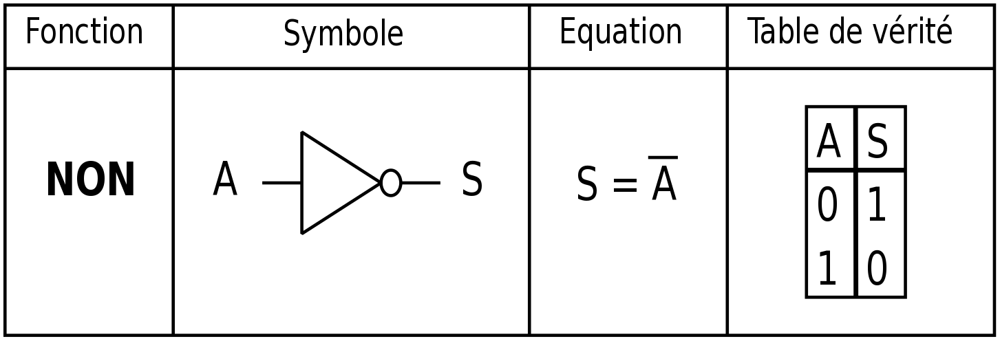
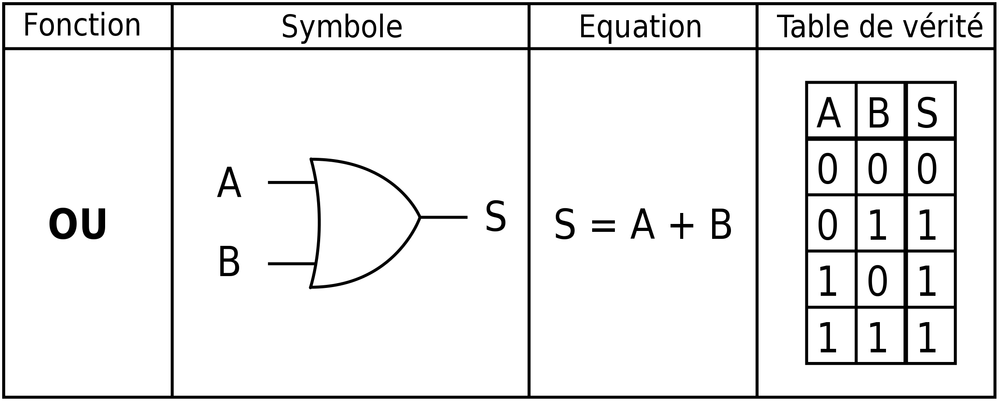
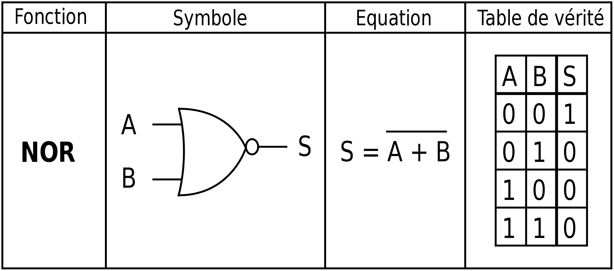
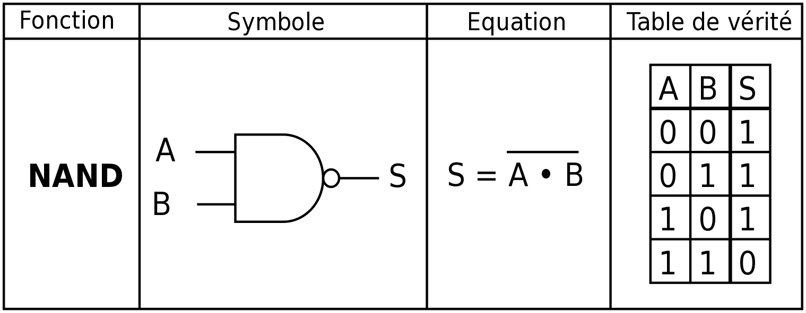
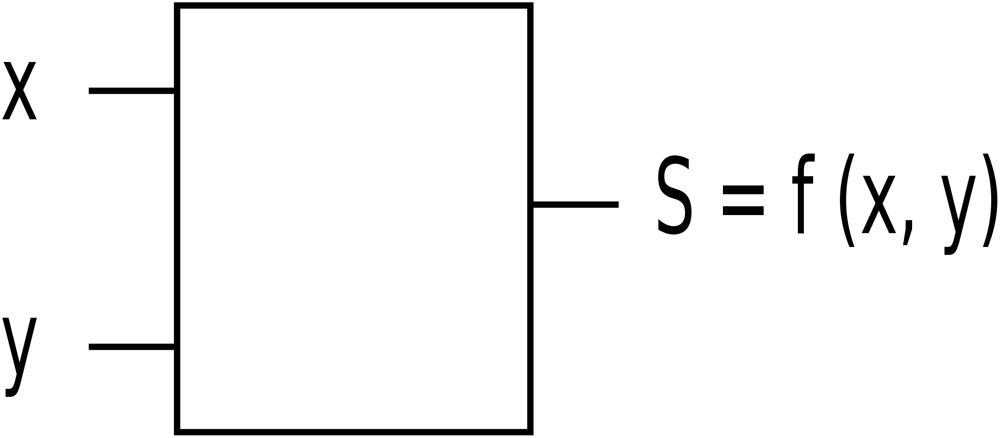
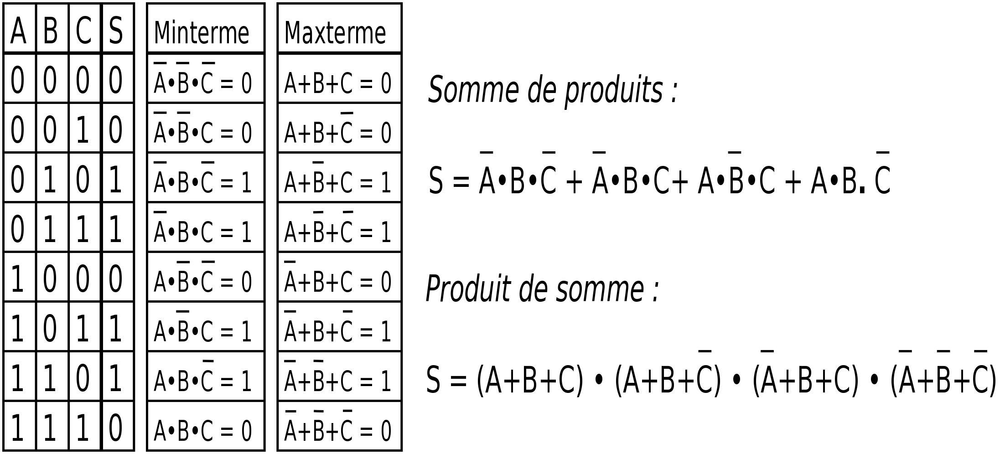

**Circuits logiques combinatoires**
==========================

## [Mamadou Lamine Ndiaye](mailto:mamadoulamine.ndiaye@ucad.edu.sn), ESP Dakar

> Document en cours de relecture, version du 2016/01/25

## Éléments de base des systèmes logiques ##

Dans les circuits logiques, le codage des informations utilise deux niveaux de tension et un état logique est associé à chaque niveau de tension.  Les systèmes numériques (logiques) fonctionnement en binaire c’est à dire que les variables discrètes (entrées ou sorties) du système ne prennent que deux valeurs *0* ou *1*. L’état d’une variable logique peut être *faux* ou *vrai*. On représente l’état faux par *0* et l’état vrai par *1*.

Par exemple, pour la technologie électrique TTL, le *0* logique correspond à une tension entre 0 et 0,8V, alors que le *1* logique correspond à une tension entre 2,4 et 5V.

Si nous prenons l’exemple d’un moteur électrique, le *0* logique peut correspondre à l’état *Arrêt*, alors que le *1* logique peut correspondre à l’état *Marche*.

## Algèbre de BOOLE ##

La logique binaire peut être représentée par l’Algèbre de BOOLE, qui permet de décrire dans un modèle mathématique le traitement et le fonctionnement des systèmes binaires. 
L’Algèbre de BOOLE est conçue autour d’opérations logiques de base :

* le complément logique : NON, représenté par un surligné
* l'addition logique : OU, représenté par le signe __+__
* produit logique : ET, représenté par le signe __•__
* et leurs dérivés (XOR, NAND, NOR, etc)

## Portes logiques ##

Les éléments de base des systèmes logiques sont des portes logiques que l’on peut assembler pour réaliser des fonctions logiques qui peuvent à leur tour êtres assemblées pour construire des machines numériques. 

La seule porte intéressante à une entrée est l'inverseur :

La table de vérité qui est un tableau qui indique la valeur de la sortie pour toutes les combinaisons des entrées. Chaque ligne correspond à une combinaison des variables. Ici, elle n'a que deux lignes.

Les deux portes de base à 2 entrées sont la porte OU et la porte ET :

Les tables de vérité ont alors 4 lignes.

Les autres portes logiques à deux entrées sont des dérivées des éléments de base troisième élément de base :

## Expression mathématique d’une fonction logique ##

Tout système logique peut être défini à l’aide d’une fonction logique (ou expression logique) qui représente les relations entre les variables de sortie en fonction des variables d’entrée. 

La représentation des fonctions logiques se fait:

* de manière  algébrique (représentation mathématique), déjà utilisé la représentation algébrique avec les équations logiques. Exemple :  
* de manière  tabulaire (table de vérité), une table de vérité est un tableau à 2^N^   lignes et N+1 colonnes. Chaque ligne correspond à une combinaison des N variables. Les N premières colonnes contiennent les variables  et la colonne N+1 contient la valeur de la fonction
* de manière graphique avec un logigramme qui est un schéma illustrant l’expression d’une fonction logique avec les portes logiques (Exemple du schéma de la porte XOR). 
* avec des diagrammes, plusieurs diagrammes existent, nous présenterons celui de Karnaugh lors de la leçon sur la synthèse des circuits logiques combinatoires.

L’expression en algèbre de Boole d’une fonction logique peut être faite sous deux formes : la forme *somme de produits* et la forme *produit de sommes*. L’expression sous la forme somme de produit est obtenue à partir de la somme de tous les lignes de la table de vérité où la fonction vaut 1. On appelle ces lignes *mintermes*.

L’expression sous la forme *produit de sommes* est obtenue en multipliant tous les *maxtermes* pour lesquels la fonction vaut 0.

## Propriétés de l’Algèbre de BOOLE ##

Il est souvent utile de simplifier ces expressions pour réduire le nombre de portes logiques et par conséquent le coût du matériel ou le temps de câblage. On utilise alors les propriétés de l’Algèbre de BOOLE.

Commutativité :

$\mathrm{A\bullet B=B\bullet A}$

$\mathrm{A+B=B+A}$

Idempotence :

$\mathrm{A\bullet A=A}$

$\mathrm{A+A=A}$

Constantes :

$\mathrm{A\bullet 0=0}$

$\mathrm{A\bullet 1=A}$

$\mathrm{A+0=A}$

$\mathrm{A+1=1}$

Complémentation :

$\mathrm{A\bullet \overline{A}=0}$

$\mathrm{A+\overline{A}=1}$

Distributivité :

$\mathrm{A\bullet (B+C)=(A\bullet B)+(A\bullet C)}$

$\mathrm{A+(B\bullet C)=(A+B)\bullet (A+C)}$

Associativité :

$\mathrm{A\bullet (B\bullet C)=(A\bullet B)\bullet C=A\bullet B\bullet C}$

$\mathrm{A+(B+C)=(A+B)+C=A+B+C}$

De Morgan :

$\mathrm{\overline{A\bullet B}=\overline{A}+\overline{B}}$

$\mathrm{\overline{A+B}=\overline{A}\bullet \overline{B}}$

Ces propriétés sont utilisées pour la simplification des fonctions logiques. Elles permettent d’obtenir une expression logique comportant un nombre minimal de termes, ainsi qu’un nombre minimal de variables dans chaque terme dans le but de simplifier la réalisation matérielle. 

