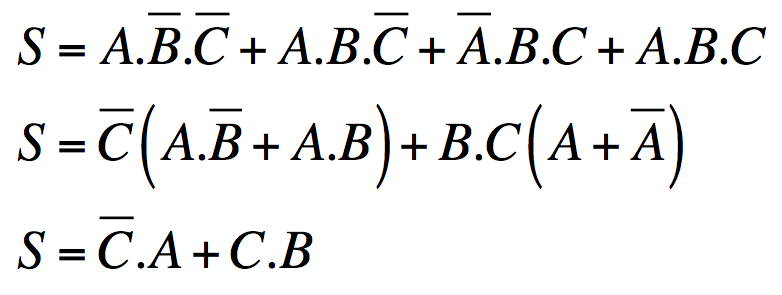
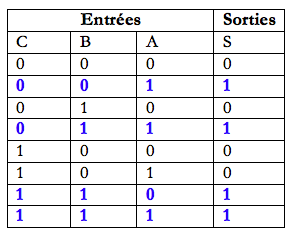
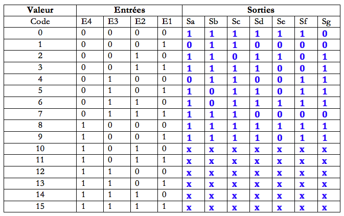
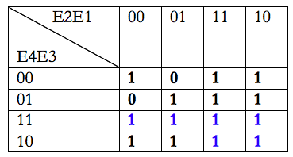
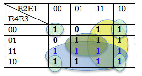
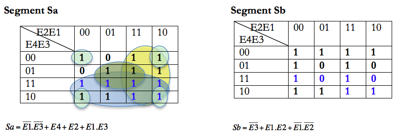
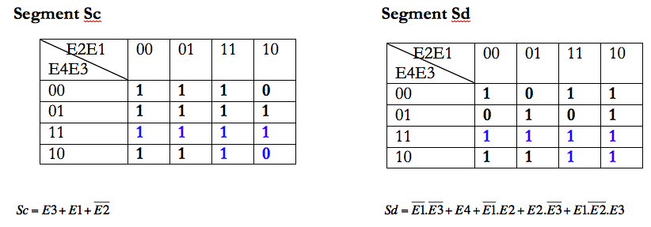
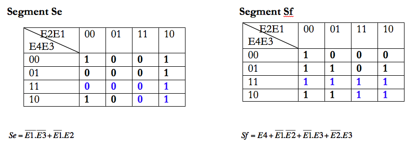

**Synthèse de circuits combinatoires**
==========================

## [Mamadou Lamine Ndiaye](mailto:mamadoulamine.ndiaye@ucad.edu.sn), ESP Dakar

> Document en cours de relecture, version du 2015/01/25

## Système combinatoire ##

C’est un système où chacune des sorties est une combinaison logique des entrées à l’instant seulement.
Une sortie ne dépend que des combinaisons d’entrée. Pour une combinaison des variables d’entrée, l’état de la sortie est unique.

## Méthodologie de synthèse des circuits combinatoires ##

La méthodologie de synthèse des circuits combinatoires se fait en en plusieurs étapes:

* Analyse du cahier des charges
* Identification des variables d’entrées et de sorties
* Représentation du problème sous forme de table de vérité
* Établissement de la ou des fonctions fonctions résultantes
* Simplification et établissement de logigramme
* Prototypage d’essai et réalisation finale

A partir d’un cahier des charges, il faut analyser le problème pour une bonne compréhension permettant sa traduction en circuit logique.
L’étude du cahier des charges permet d’identifier les variables du système (entrée, sortie). Lorsque le nombre de variables est faible, on peut utiliser directement la table de vérité. Dans le cas contraire le circuit est décomposé en différents blocs fonctionnels que l’on peut étudier séparément. Dans tous les cas il est nécessaire d’établir la ou les fonctions logiques et éventuellement procéder à leur simplifications avant d’envisager le prototype et la réalisation finale.

## Simplification des fonctions logiques ##
La simplification des fonctions logique cherche à obtenir une expression logique comportant un nombre minimal de termes, ainsi qu’un nombre minimal de variables dans chaque terme dans le but de simplifier et de réduire le coût de la réalisation matérielle. Plusieurs méthodes existent ;

## Simplification Algébrique ##
Elle utilise les théorèmes généraux de l’Algèbre de BOOLE et aux identités remarquables (formules élémentaires) que nous avons vu lors de la leçon précédente.

Le principe consiste à :

* Regroupement des termes ayant des variables communes et mises en facteur
* Réplication de termes existants
* Suppression de termes superflus

Exemple :

En factorisant et en utilisant les propriétés de BOOLE on a :

## Simplification par Tableau de KARNAUGH ##

Le tableau de Karnaugh est une forme particulière de la table de vérité. Il comprend 2^N^  cases, N étant le nombre de variables d’entrées de la fonction considérée. Dans chaque case est inscrite la valeur de la sortie.
Les variables sont disposées selon le code GRAY ou code binaire réfléchi.  Lorsque l’on passe d’une case à la case adjacente, une seule variable change.
Simplification : Pour exprimer la sortie S:

* Effectuer des groupements de cases adjacentes successivement contenant des 1.
* La taille d’un groupe est une puissance de 2^k^     (8,4,2,1...). On cherche toujours le groupement maximal.
* Le résultat d’un groupement est le produit des variables constantes (qui ne changent pas).
* Le résultat final est la somme des résultats  des groupements.
* Une même case peut appartenir à deux groupements différents.

Exemple:
Considérons l’exemple de la table de vérité suivante :

Tableau de Karnaugh

En regroupant les 1, on a $\mathrm{S=A.\overline{C} + B.C}$

Schéma logique

En utilisant l’expression sous forme de produit de somme on regroupe les 0 et on a :

Schéma logique

## Diagramme temporel ##

Tracez les formes d’onde de sortie pour la sortie X pour la figure ci-dessous.

Dans un système numérique de traitement d’informations plusieurs opérations sont nécessaires : le codage et le décodage (transposition de données d’un code à un autre), le multiplexage (aiguillage des données) etc., Ces opérations sont effectuées par des circuits combinatoires spécialisés. Nous allons maintenant regarder comment synthétiser un décodeur 7 segments.

### Décodeur 7 segments ###

Un décodeur est un circuit qui permet de passer d’un code à un autre. Il comporte N entrées et M sorties. Le décodeur 7 segments permet de transcoder chaque chiffre séparément :unité, dizaine centaine etc. Il s’appuie sur le codage BCD (Décimal codé en Binaire) qui  transforme les nombres décimaux en remplaçant chacun des chiffres décimaux par 4 chiffres binaires. Chaque chiffre (de 0 à 9) est codé en binaire sur 4 bits (E1, E2, E3 et E4). Pour un nombre à 3 chiffres (ex : 123), on aura 4 valeurs binaires pour chaque chiffre : centaines, dizaines et unités : 0001 0010 0011. Le décodeur permet de transformer ces 4 bits provenant des 4 fils en entrée (E1, E2, E3, E4) du décodeur en 7 bits à la sortie du décodeur. Chaque fil de la sortie du décodeur est connecté à une LED de l’afficheur (a, b, c, d, e, f, g).

Chaque afficheur alimente ses 7 segments (leds) en fonction du code binaire à la sortie du décodeur correspondant  aux chiffres de 0 à 9 ainsi que les lettres de A à F.

#### Table de vérité du Décodeur 7 Segments en décimal ####

Avec les 4 variables d’entrée on a 24 soit 16 cases dans la table de vérité mais nous n’avons besoin que des dix premières valeurs (0 à 9). Il y a donc 6 valeurs à éliminer 10, 11, 12,13,14 et 15. On mettre un x  (x = 0 ou 1) au niveau des sorties pour ces différentes valeurs.

#### Equations logiques des 7 sorties en décimal ####
Segment Sa

#### Simplification des équations logiques des 7 segments ####

Le logigramme du décodeur pourra être réalisé à partir de ces équations.

