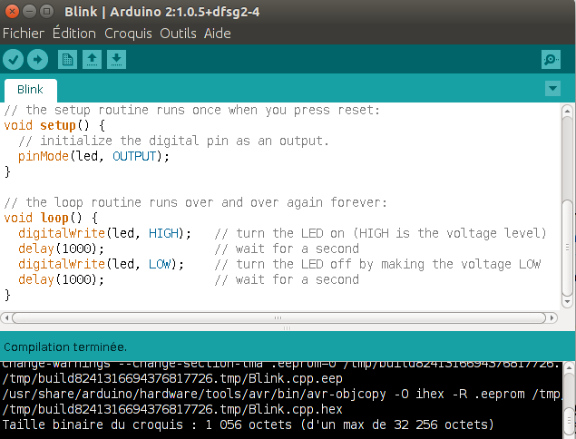
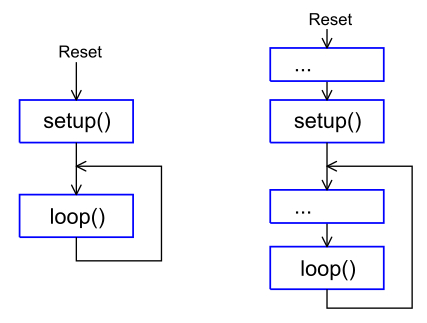

% Programmation en C-Arduino
% [Pierre-Yves Rochat](mailto:pyr@pyr.ch), EPFL
% rév 2016/01/04

## Différentes significations du mot Arduino ##

L’**Arduino** a participé à rendre populaires les microcontrôleurs de manière extraordinaire. Qu’est-ce qui se cache derrière ce nom ?

Il faut différencier trois significations différentes du mot Arduino :

* une carte à microcontrôleurs
* un environnement de développement
* une librairie pour microcontrôleurs.

`1.` L’Arduino est une **carte à microcontrôleurs**, plus exactement une famille de cartes. L’**Arduino UNO** est la plus connue. Elle contient un microcontrôleur AVR du fabricant Atmel, le modèle ATmega328. Un câble USB permet de la brancher sur un PC, principalement pour déposer un programme dans le microcontrôleur. Les cartes Arduino sont *open hardware* : leurs plans sont publiques. Comme elles sont produites par de nombreux fabricants, leur prix est très favorable.

`2.` Le **programme Arduino** est aussi environnement de développement (IDE = Integrated Developpement Environnement). C’est donc un logiciel qui s’exécute sur un PC. Il fonctionne sur les principaux systèmes d’exploitation courant : Windows, Linux et MacOS. Il associe principalement un éditeur et un compilateur C. Il permet d’écrire un programme, de le compiler et de l’envoyer sur une carte Arduino. C’est un logiciel libre, écrit en Java, inspiré de l’environnement *Processing*.

On voit sur cette copie d’écran que l’interface est très simple :

Plusieurs programmes similaires au programme Arduino existent pour supporter d’autres cartes à microcontrôleurs. C’est le cas du programme **Energia**, qui supporte les cartes Launchpad MSP430 de Texas Instrument. Nous utiliserons souvent cet environnement dans ce cours.

`3.` Finalement, on utilise souvent le mot Arduino pour désigner un **langage de programmation**. Il ne s’agit pas à proprement parlé d’un langage, mais plutôt d’un ensemble de procédures. Rappelons qu’une procédure est un ensemble d’instructions, écrites dans un langage de programmation. Ces procédures sont groupées dans une *librairie* (traduction abusive du mot anglais *library*). Ces procédures permettent de mettre en œuvre un microcontrôleur de manière très simple. Elles sont écrites en C, plus exactement en C++.

Ces procédures sont similaires au langage *Wiring*, qui a précédé l’Arduino. Ce terme serait plus correct, mais il est moins connu. Nous utiliserons dans ce cours l’expression **programmation en C-Arduino** pour désigner le fait de développer des programmes pour microcontrôleurs avec le langage C et les procédures Arduino. C’est le sujet de cette leçon. Plus exactement, nous allons décrire un minimum de procédures qui vont nous permettre de programmer nos premières enseignes à LED.

## Cacher la complexité du microcontrôleur ##

Le but du C-Arduino est de cacher en partie la complexité du microcontrôleur. Accessoirement, c’est un moyen d’écrire des programmes qui peuvent, dans une certaine mesure, s’exécuter sur plusieurs modèles de microcontrôleurs.

Nous allons présenter ici :

* la structure générale d’un programme
* les entrées-sorties
* la gestion du temps.

## La structure générale d’un programme ##

Plutôt que d’écrire un programme complet, avec sa procédure `main()`, Arduino nous propose d’écrire deux procédures : `setup()` et `loop()`.

La procédure `void setup()` s’exécute une seule fois au début de l’exécution du programme, qui correspond au *Reset* du microcontrôleur. Notons qu’un *Reset* se produit automatiquement lorsqu’on applique la tension d’alimentation sur un microcontrôleur. La procédure `setup()` s’exécute donc lorsqu’on allume notre dispositif. Elle contient généralement toutes les initialisations matérielles et logicielles nécessaires pour la suite du programme.

La procédure `void loop()` est appelée à la suite de `setup()`. Mais, contrairement au `setup()` qui n’est appelé qu’une fois, elle est appelée en permanence. Elle correspond donc à la boucle principale du programme, d’où son nom. Rappelons que les programmes pour microcontrôleur n’ont généralement pas de fin : l’exécution se poursuit jusqu’à ce que le microcontrôleur ne soit plus alimenté ou jusqu’à un *Reset*.

## Organigramme ##

Une des manière de représenter le déroulement d’un programme est l’organigramme.
Voici donc l’organigramme général d’un programme Arduino :

{ width=7cm }

L’organigramme à gauche de la figure correspond à ce que voit l’utilisateur. Mais en fait, derrière l’usage de `setup()` et `loop()` proposé par Arduino, des instructions cachées s’exécutent avant chacune de ces procédures, comme le montre l’organigramme de droite. C’est dans la procédure `main()` produite par l’environnement Arduino que ces instructions sont ajoutées.

Il faut noter que la procédure `loop()` a une durée d’exécution qui peut varier considérablement d’un programme à un autre. Pour une enseigne ou un afficheur à LED, elle pourrait par exemple durer le temps d’un cycle complet de l’animation. Mais elle pourrait tout aussi bien durer un temps très court, par exemple un temps fixe de 10 microsecondes. Tout dépendra de la manière de programmer.

### Exemple ###

Le programme suivant est un programme Arduino correct :

~~~~~~~ { .c .numberLines startFrom="1" }
void setup() {
}

void loop() {
}
~~~~~~~
<!-- retour au mode normal pour l'éditeur -->

Il est possible de le compiler et de l’exécuter... mais il ne fait rien !

## Les entrées-sorties ##

L’usage des broches du microcontrôleur comme entrée ou comme sortie se fait par l’intermédiaire de registres spécialisés. Leurs noms et leurs rôle exacts varient d’un microcontrôleur à l’autre. Pour faciliter l’utilisation des broches comme entrées ou comme sorties, trois procédures sont proposées :

* `void pinMode(pin, mode)`
* `void digitalWrite(pin, value)`
* `value digitalRead(pin)`

### pinMode() ###

La procédure `void pinMode(pin, mode)` est une procédure d’initialisation. Elle permet de placer une broche du microcontrôleur en entrée ou en sortie. Elle reçoit deux paramètres :

* `pin` : c’est le numéro logique de la broche. Attention, c’est un numéro qui a été arbitrairement choisi. Sur les cartes Arduino, c’est le numéro qui est noté sur la carte. Sur Energia, c’est le numéro de la broche sur le boîtier du microcontrôleur. Il s’agit d’un boîtier à 20 broches (DIL20).
* `mode` : la valeur INPUT place la broche en entrée, la valeur OUTPUT place la broche en sortie.

La procédure `pinMode()` ne rend rien à la fin de son exécution, d’où le mot `void` qui précède sa définition.

### digitalWrite() ###

La procédure `void digitalWrite(pin, value)`  permet d’agir sur une broche qui a été programmée en sortie. C’est une écriture. Elle permet de placer un 0 ou un 1 sur la sortie. Elle reçoit deux paramètres :

* `pin` : c’est le numéro logique de la broche.
* `value` : la valeur à donner à la sortie, 0 ou 1. Les symboles LOW (bas, 0) et HIGH (haut, 1) peuvent aussi être utilisés.

La procédure `digitalWrite()` ne rend rien à la fin de son exécution.

### digitalRead() ###

La procédure `value digitalRead(pin)`  permet de lire le niveau logique sur une broche qui a été programmée en entrée. La valeur rendue sera 0 ou 1 (`LOW` ou `HIGH`). Elle reçoit un seul paramètre :

* `pin` :  le numéro logique de la broche.

La procédure `digitalWrite()` rend à la fin de son exécution la valeur lue. Ce sera un 0 ou un 1.

### Exemple ###

Voici un programme qui utilise les instructions que nous venons de voir. Il semble correct :

~~~~~~~ { .c .numberLines startFrom="1" }
void setup() {
  pinMode(P1_0, OUTPUT);
  pinMode(P1_3, INPUT);
}

void loop() {
  digitalWrite(P1_0, (digitalRead(P1_3));
}
~~~~~~~
<!-- retour au mode normal pour l'éditeur -->

En permanence, il écrit sur la broche P1_0, qui est la LED rouge du Launchpad, la valeur lue sur P1_3, qui est le bouton-poussoir. On devrait donc voir la LED rouge s’allumer lorsque le bouton-poussoir est pressé et s’éteindre lorsqu’il est relâché. Malheureusement... il ne fonctionne pas ! Il faut modifier la ligne d’initialisation de la manière suivante pour qu’il fonctionne un peu mieux :

~~~~~~~ { .c .numberLines startFrom="3" }
  pinMode(P1_3, INPUT_PULLUP);
~~~~~~~
<!-- retour au mode normal pour l'éditeur -->

C’est une raison électrique qui oblige l’utilisation du mode `INPUT_PULLUP`. Elle sera expliquée en détail dans une prochaine leçon. On apprendra aussi pourquoi ce programme fait l’inverse de ce qu’on avait imaginé : la LED sera allumée tant qu’on ne presse pas sur le bouton-poussoir et s’éteindra lorsqu’on le presse.

## La gestion du temps ##

L’utilisation d’un microcontrôleur et d’un programme pour commander une enseigne à LED est motivée par l’envie de produire des animations visuelles. Ces animations sont des variations au cours du temps de l’état des LED. Il nous faut donc la possibilité de maîtriser le temps qui passe. Nous allons le faire avec la procédure `delay()`.

La procédure `void delay(ms)`  permet d’attendre un temps donné. Ce temps est exprimé en ms (milliseconde). Elle ne rend rien à la fin de son exécution.

## Programme *blink* ##

Prenons quelques-unes des procédures que nous venons de présenter pour écrire un programme tout simple, qui fait clignoter une LED (*blink* en anglais).

~~~~~~~ { .c .numberLines startFrom="1" }
void setup() {
  pinMode(P1_0, OUTPUT);
}

void loop() {
  digitalWrite(P1_0, 1);
  delay(500);
  digitalWrite(P1_0, 0);
  delay(500);
}
~~~~~~~
<!-- retour au mode normal pour l'éditeur -->

On y trouve la procédure `setup()` qui met en sortie la broche sur laquelle la LED rouge du LaunchPad est branchée.

La procédure `loop()` allume la LED, puis attend une demi-seconde, puis éteint la LED et attend à nouveau une demi-seconde. Tout le cycle dure une seconde. On a donc produit un *signal carré* de 1 Hz.

Voici un chronogramme qui montre l’évolution de la sortie en fonction du temps :

Ce programme est un *classique* dans le monde des microcontrôleurs. Presque tous les projets commencent par lui ! En effet, on essaie presque toujours d’avoir au moins une LED dans un montage à microcontrôleurs. Au moment des premiers tests, ce programme va permettre de s’assurer que le microcontrôleur est bien fonctionnel et que l’environnement utilisé permet de le programmer.

## Une riche librairie ##

La librairie Arduino contient de nombreuses autres procédures. Elles sont bien documentées.

Elle est complétée par d’innombrables autres librairies, souvent développées pour l’usage d’un matériel particulier, comme les cartes-filles (*shields*) qu’on peut placer sur les cartes de base (Arduino, Launchpad, etc).

Le domaine des enseignes et afficheurs à LED n’est pas de reste à cet égard. De nombreux fournisseurs proposent du matériel et les librairies associées. Il semble facile de jouer à l’apprenti-sorcier en assemblant ce matériel et en mettant en œuvre les librairies proposées.

Mais il faut bien admettre qu’on se trouve souvent devant des problèmes insolubles lorsqu’on ne maîtrise pas ce qu’on fait... Le but de ce cours est de comprendre ce qui se passe, afin d’être capable de concevoir des enseignes et afficheurs à LED.

