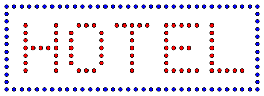
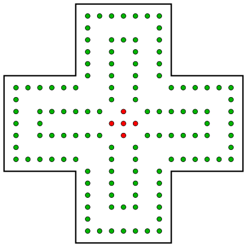
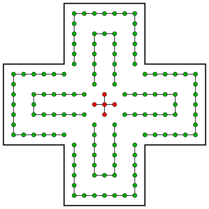

% Enseignes à motifs fixes
% [Pierre-Yves Rochat](mailto:pyr@pyr.ch), EPFL
% rév 2015/09/15

## Placer des LED fixes pour former une enseigne ##

Une des applications les plus simples des LED est la réalisation d’enseignes à motifs fixes. La disponibilité de LED rouges, vertes, bleues, oranges et blanches, pour ne citer que les plus courantes, permet de réaliser des enseignes multicolores.

Voici deux exemples très simples :

{ width=10cm }

{ width=7cm }

La première enseigne affiche un mot lisible : HOTEL. Ce mot ne peut être changé, car les LED sont disposées de façon à former le mot HOTEL. La seconde enseigne affiche un motif géométrique qui fait penser à une croix de pharmacie.

On peut construire de telles enseignes en fixant des LED sur des panneaux par exemple en plexiglas. En allumant les LED, on produit un effet lumineux qui attire le regard et qui de plus est visible de nuit. En fait, plus l’intensité de la lumière ambiante est faible, mieux l’enseigne se verra.

## Découper le motif en segments ##

Mais on peut aller plus loin en découpant les motifs en différentes parties. Le terme “segment” sera souvent utilisé, bien que chaque partie n’a pas forcément la forme d’un segment de droite. Il est alors possible de commander chaque segment individuellement. On programmera alors des animations qui attirent l’œil, telles que des clignotements, des chenillards et même des variations continues d’intensité par PWM. Ce sujet sera abordé plus tard dans ce cours.

Voici comment l’enseigne de pharmacie peut être découpée en segments :

{ width=7cm }

Il y a neuf segments dans cet exemple, huit verts et un rouge.

## Schéma avec un transistor ##

Comment connecter ensemble un grand nombre de LED pour que les motifs formés puissent être commandés facilement, par exemple par un microcontrôleur ?

Le courant consommé par une LED standard est d’environ 10 mA, bien qu’il existe aussi des LED beaucoup plus puissantes, plutôt utilisées pour l’éclairage. Les sorties des circuits intégrés logiques et des microcontrôleurs permettent en général de fournir quelques dizaines de milliampères, soit un courant suffisant pour une ou deux LED. Pour davantage de LED, un transistor bipolaire ou MOS sera utilisé.

Voici le schéma utilisé, comportant un transistor NPN :

{ width=8cm }

Une sortie du microcontrôleur va commander la base du transistor à travers une résistance. Lorsque la sortie est à l’état 0, aucun courant ne peut circuler dans la base du transistor, qui est alors bloqué : aucun courant ne peut circuler entre le collecteur et l’émetteur, toutes les LED seront donc éteintes.

La valeur de la résistance de base sera déterminée de telle manière à être certain que le transistor soit saturé lorsque la sortie du microcontrôleur est à l’état logique 1. Il faut tenir compte de la tension de la sortie à l’état 1, souvent 3.3 V ou 5 V, selon la tension d’alimentation du microcontrôleur. Il faut lui soustraire la tension base-émetteur du transistor, qui est de 0.7 V. On s’assurera ensuite que le courant de base soit supérieur au courant de collecteur divisé par le facteur d’amplification du transistor.

Même si elles sont regroupées en un seul motif, commandé par une seule sortie d’un microcontrôleur, il est toujours nécessaire de placer une résistance de limitation de courant pour chaque LED. Il est fortement déconseillé de n’utiliser qu’une seule résistance en série avec plusieurs LED reliées en parallèle, car cette façon de faire ne permet pas d’ajuster le courant consommé par chacune des LED, donc la luminosité de l’afficheur ne sera pas constante. Ceci est dû au fait qu’il y a des dispersions importantes dans les caractéristiques des LED, même si elles sont du même fabricant et de la même série de production.

## Placer plusieurs LED en série ##

Il est possible d’augmenter la tension d’alimentation et de placer plusieurs LED en série pour une seule résistance de limitation. Le courant est exactement le même dans chaque LED d’une branche !

Ce schéma montre comment commander plusieurs LED en série avec un transistor, avec une ou plusieurs branches :

{ width=7cm }

Il faut connaître la tension de chaque LED pour choisir le nombre optimal de LED dans chaque branche. Les LED rouges ont en général une tension d’environ 2 V, alors que les vertes ou les bleues ont plutôt 3 V. Mais il existe plusieurs technologies pour produire des LED et il faut bien se renseigner concernant les LED choisies... ou simplement les mesurer !

Avec une tension d’alimentation de 12 V, on peut alimenter par exemple 5 LED rouges ou 3 LED vertes. Notez qu’avec un seul transistor faible signal, il est possible de commander un grand nombre de LED. Par exemple, un BC337, dont le courant maximal est d’environ 500 mA (cette valeur varie selon les fabricants) permet de commander jusqu’à environ 250 LED rouges avec cette technique : chaque groupe de 5 LED en série reçoit 10 mA et il est possible de placer 50 branches.

Prenons un autre exemple. Avec une alimentation de PC portable, fournissant 16 V et un maximum de 4.5 A, combien de LED vertes est-il possible de commander ? La tension aux bornes de chaque LED doit être d’environ 3 V, pour un courant de 10 mA.

Voici la réponse : on peut mettre 5 LED en série (15 V) avec une résistance de limitation. Il est possible de placer 450 groupes de LED `(450 × 10 mA = 4.5 A)`. C’est donc un total de 2’250 LED qu’il est possible de commander !

Dans ce cas, voici comment calculer la valeur de la résistance série : les 5 LED présentent une différence de potentiel de 3 V à leurs bornes. Il reste `16 – (5 × 3) = 1 V` aux bornes de la résistance. Pour un courant nominal, il faut `R = U / I = 1 V / 10 mA = 100 Ω`.

En pratique, on réalisera un montage de test avec les 5 LED et une résistance, sans oublier le transistor, qui a aussi une chute de tension. On mesurera la tension aux bornes de la résistance, on calculera le courant qui la traverse `(I = U / R)`. On corrigera ensuite la valeur de la résistance pour se rapprocher du courant souhaité (par exemple 10 mA) et on reprendra le test.

Il est même possible de commander un segment contenant des LED de plusieurs couleurs. Voici un schéma correspondant :

{ width=9cm }

## Courants importants ##

Ce type de montage peut nécessiter des courants d’alimentation importants. Lorsque des milliers de LED sont utilisées pour un seul segment, il faudra utiliser un transistor correctement dimensionné.

Il faudra aussi réaliser un câblage électrique adapté : la section de cuivre du fil ou du câble utilisé devra être choisie correctement. Si le fil est long, la chute de tension peut devenir non négligeable, et donc influencer le courant dans les LED et par conséquent leur luminosité.

Comme il y a en général un nombre important de segments, ce sont surtout les courants dans les conducteurs d’alimentation qui peuvent devenir importants. C’est le cas du câblage qui apporte la tension positive sur les anodes des transistors. Mais c’est tout autant le cas dans les câblages de la masse.

La figure suivante montre l’importance des courants :

{ width=15cm }

## Programmation d’animations ##

Le premier programme souvent proposé pour apprendre à mettre en œuvre un microcontrôleur, le fameux *blink* est déjà un programme d’animation d’une enseigne, avec une seule sortie ! Fondamentalement, il est facile d’écrire une animation. Il faut écrire les instructions pour mettre les sorties dans un certain état, puis attendre un certain temps. L’animation va comporter un certain nombre de ces paires d’instructions et tournera en boucle. Prenons un exemple très simple, qui produit une animation du type *chenillard* :

~~~~~~~ { .c .numberLines startFrom="1" }
void setup() {
  P2DIR |= 0xFF; // P2.0 à P2.7 en sortie
}

void loop() { // Boucle infinie, correspond à toute l'animation
  P2OUT  = 0;                  // éteint toutes les LED
  P2OUT |= (1<<0); delay(200); // allume la première LED
  P2OUT |= (1<<1); delay(200); // allume successivement chaque LED...
  P2OUT |= (1<<2); delay(200);
  P2OUT |= (1<<3); delay(200);
  P2OUT |= (1<<4); delay(200);
  P2OUT |= (1<<5); delay(200);
  P2OUT |= (1<<6); delay(200);
  P2OUT |= (1<<7); delay(1000);// attend un peu après la dernière LED
  P2OUT  = 0;      delay(500); // éteint toutes les LED pendant 1/2 seconde
  P2OUT  = 0xFF;   delay(500); // allume toutes les LED
  P2OUT  = 0;      delay(500); // répète...
  P2OUT  = 0xFF;   delay(1000);
  P2OUT  = 0;      delay(500); // pause avant la reprise de l'animation
}
~~~~~~~
<!-- retour au mode normal pour l'éditeur -->

On aurait pu utiliser uniquement des procédures `pinMode()` pour l’initialisation et `digitalWrite()` pour les animations. Dans un cas comme dans l’autre, le style de ce programme n’est pas un modèle du genre et a donc nécessité de nombreux commentaires. Or *un programme bien écrit ne nécessite pas beaucoup de commentaires*, alors qu’on voudrait souvent vous faire croire que plus un programme comporte de commentaires, mieux il est écrit !

L’utilisation de définitions comme :

~~~~~~~ { .c }
#define Led1ON P2OUT |= (1<<0)
#define Led1OFF P2OUT &=~(1<<0)
~~~~~~~
<!-- retour au mode normal pour l'éditeur -->

rendrait le code plus lisible.

Mais le fait d’utiliser l’accès aux sorties par le registre `P2OUT` permet de programmer plus simplement la fonction du chenillard :

~~~~~~~ { .c .numberLines startFrom="1" }
void ChenillardAjoute(uint16_t attente) {
  unit16_t i;
  for (i=0; i<8; i++) {
    P2OUT |=(1<<i);
    delay(attente);
  }
}
...
void loop() { // Boucle infinie, correspond à toute l'animation
  ChenillardAjoute(200);
  delay(800); // attend un peu après la dernière LED
  P2OUT = 0; delay(500); // éteint toutes les LED pendant 1/2 seconde
  ...
}
~~~~~~~
<!-- retour au mode normal pour l'éditeur -->

On pourrait aussi écrire une fonction chenillard encore plus générale, avec en paramètres non seulement le temps d’attente, mais le sens du mouvement et le fait de garder ou non les LED précédentes allumées.

Que vois-je ? Ai-je écrit le mot *mouvement* ? Est-ce que les LED bougent ? C’est toute la magie des LED... Elles ne bougent pas, mais peuvent donner l’impression de mouvement.

