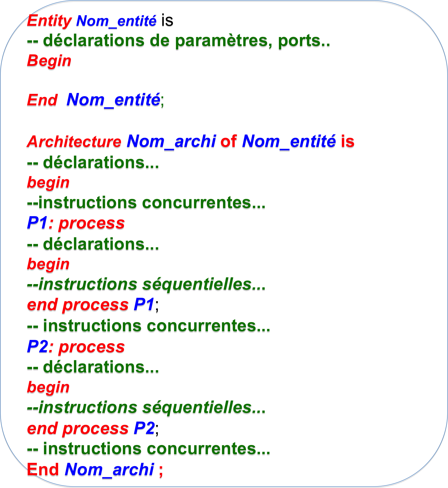
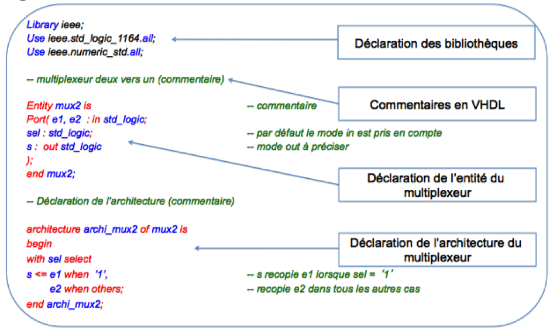
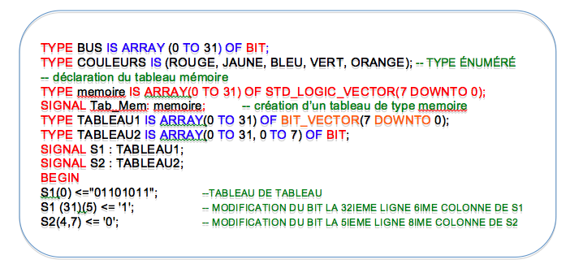
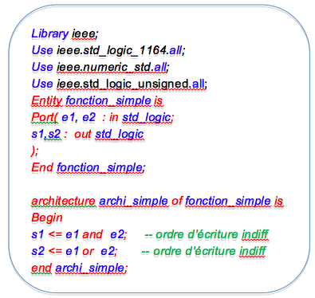
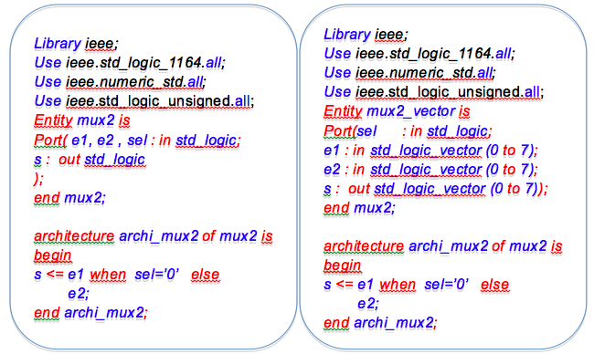
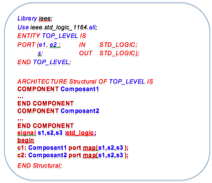
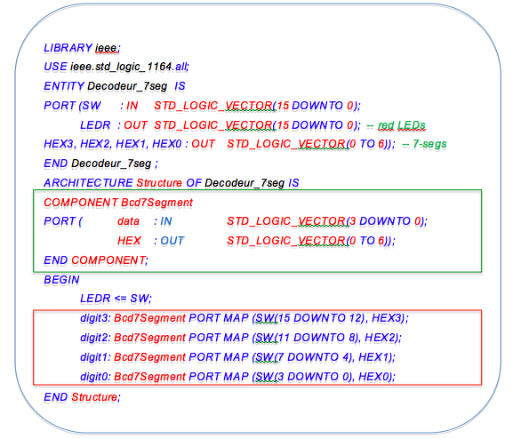

**Introduction au VHDL : instructions concurrentes**
==========================

## [Mamadou Lamine Ndiaye](mailto:mamadoulamine.ndiaye@ucad.edu.snp), ESP Dakar

> Document en cours de relecture, version du 2015/01/25

## Introduction au VHDL ##

#### Introduction ####

Les méthodes de conception des circuits logiques ont beaucoup évoluées depuis les premiers circuits programmables par l’utilisateur apparus dans les années 90. Les circuits logiques standard avec les technologie TTL et CMOS sont suivis des circuits logiques à fonctionnement programmables avec les microprocesseurs et les microcontrôleurs et les circuits intégrés spécifiques (ASICs) fabriqués en grande série.
La complexité de plus en plus croissante des circuits numériques à motiver le développement des logiciels de description structurelle. Nous avons aujourd’hui des circuits numériques de quelques centaines de portes logiques (PAL) à des millions de portes logiques (FPGA). Nous assistons aussi aujourd’hui à une unification des outils d’aide à la conception autour du langage VHDL.

Le sigle VHDL signifie "VHSIC Hardware Description Langage" ou en Français "langage de description de matériel" et le sigle VHSIC signifie "Very High Speed Integrated Circuit" ou en Français "Circuit intégré à très haute vitesse".

Le VHDL peut être utilisé pour la modélisation, la simulation et la synthèse des circuits logiques.
Le VHDL permet de faire la synthèse logique des circuits en facilitant le passage de la description comportementale à la vue structurelle. Le VHDL permet aussi de faire la synthèse physique des circuits en générant la vue physique du circuit à partir de la description structurelle. La synthèse physique aboutit à la liste des portes logiques nécessaires à la réalisation du circuit ainsi qu’à leurs interconnexions.

Les niveaux de description peuvent être :

* Comportemental ou fonctionnel
	-	Le modèle est décrit par, sa fonction, son algorithme. Il s’agit de décrire comment cela fonctionne.
* Structurel (RTL « Register Transfert Logic »)
	-	Le modèle est décrit sous forme d’éléments séquentiels, il prend en compte  la notion d’horloge, de cycle;
* Porte logique (Structurel)
	-	Le modèle est décrit par sa topologie (netlist) de portes logiques, de registres, de composants

Dans tous les cas une décomposition du cahier des charges en fonctions simples peut être nécessaire. Cette décomposition passe par l’utilisation de :

* Fonctions combinatoires (instructions concurrentes)
* Fonctions séquentielles (process)

### VHDL: Les concepts de base ###

La structure générale d’un programme VHDL est constitué de deux unités de conception dépendantes et obligatoires : une entité (vue externe du composant), det une architecture (vue interne du composant) toujours rattachée à une entité.

L’entité (*Entity*) et l’architecture (*Architecture*) sont des unités de compilation obligatoires pour décrire un modèle.  L’ensemble entité ou architecture doit être écrite dans le même fichier et un même fichier peut contenir plusieurs entités et architectures.

L’entité (Entity) permet de déclarer les modes des ports en entrée et/ou sortie (in, out, inout, buffer)
IN pour dire que le port est à lecture seule
OUT port à écriture seule
INOUT port à lecture/écriture
BUFFER écriture/lecture sur un port

L’architecture (Architecture) permet de décrire le comportement de la fonction à synthétiser, définir les signaux internes, les composants, ….
A une entité peut correspondre plusieurs architectures.

VHDL considère deux domaines d’instructions disjoints: les instructions concurrentes et séquentielles. Chaque domaine possède ses propres instructions qu’il n’est pas permis d’utiliser dans l’autre domaine.

Les instructions concurrentes modélisent des comportements asynchrones s’executant en parallèle.
Les instructions séquentielles font intervenir la notion d’ordre et de durée et modélisent des comportements procéduraux. Les instructions séquentielles ne peuvent être utilisées que dans le corps d’un processus ou d’un sous-programme.

Dans l’exemple de la figure nous présentons un multiplexeur 2 vers 1 (2 entrées e1 et e2 et la sortie s). L’architecture décrit les relations entre les entrées et la sortie. *s recopie e1 lorsque sel = ‘1’ recopie e2 dans tous les autres cas*

#### Quelques règles élémentaires ####

*	Le nom de l’entité est quelconque à l’exception des mots réservés au langage
*	la liste des ports est entre parenthèse et se termine par un point virgule.
*	Une virgule sépare 2 signaux de même type.
*	Un : entre le nom du port et son mode ou type.
*	Le nom de l‘entité est facultatif après le mot end.
*	Minuscules et majuscules sont indifférenciées.
*	Les commentaires commencent par  -- ce qui suit est considéré comme commentaire jusqu’à la ligne.
*	un point virgule marque la fin d’une instruction.
*	 L’expression <=  permet de faire l’affectation d’un signal , d’une sortie de type std_logic.
*	Les espaces ou retours lignes ne sont pas pris en compte.

Les bibliothèques ne font pas partie de la définition du langage VHDL. Chaque environnement constructeur est donc différent à cet égard.

### Les Objets et les types de base ###

Come dans tout langage le type définit l’ensemble des valeurs que peut prendre un objet, VHDL manipule quatre types d’objets.

*	Les constantes (CONSTANT) sont des objets dont la valeur ne change pas durant la simulation
*	Les variables (VARIABLE) sont des objets dont la valeur peut changer par affectation au cours de la simulation. Les variables sont toujours locales à un processus: il n’y a pas de variables globales
*	Les signaux (SIGNAL) désignent des signaux internes qui ne sortent pas du composant. Ils peuvent être déclarés n’importe où dans le programme,
sauf à l’intérieur d’un processus. Seuls les signaux peuvent communiquer entre plusieurs processus dans une architecture et avec le monde extérieur.
*	Les fichiers (FILE) permettent l’échange de données entre l’extérieur et le simulateur VHDL.

Le symbole d’affectation est :=. Si l ’on a écrit a:=b la valeur de b est affectée à a et si b évolue par la suite, a  ne changera pas pour autant.
On bornera un entier lors de sa déclaration
Exemple:    Signal s_entier : integer range  0 to 31;

Le type std_ulogic est non-résolu ce qui signifie que si un signal est source d’affectation multiple une fonction de résolution doit être définie pour lever toute ambiguïté. (std_logic associé à la fonction resolved)

* Bit : peut prendre les valeurs  `0´ ou  `1´.
* Bit_vector : groupe de bits défini entre  "  ".
* Boolean: peut prendre les valeurs true ou false.
* Integer : Valeur entière codée sur 32 bits (de  - 2.147.483.648 à 2.147.483.647)
* Std_logic, std_ulogic : Similaires au bit mais avec 9 états possibles.
* Time : comptage du temps sur 64 bits, en ps, ns, us, ms, sec, min, hr (non synthétisable) ;

Une chaine de bit  est représenté par un vecteur de bits

* std_logic_vector( 7 downto 0);  	-- bit poids fort => poids faible
* std_logic_vector( 0 to 7);  		-- bit faible poids => poids fort

### Les Opérateurs arithmétiques et logiques ###

VHDL manipule six (6) opérateurs  classiques hiérarchisés:

* 1 Opérateurs divers: 	          **, abs, not
* 2 Opérateurs de multiplication :      *, /, mod, rem
* 3 Opérateurs d’addition :          	  +, -, &
* 4 Opérateurs  relationnels :          =, /=, < , <= , >, >=
* 5 Opérateurs de décalage :   	  sll, srl , sla,sra,rol,ror
* 6 Opérateurs logiques: 		  and , or, nand, nor, xor, xnor

Le VHDL manipules 6 opérateurs qui sont définis par classes et par ordres de priorités. Nous les avons classé ici par ordre de priorité de la plus haute priorité à la plus faible priorité.

Les opérateurs  ne portent que sur les types prédéfinis, BOOLEAN, BIT, INTEGER. La plupart des outils de synthèse limitent l’utilisation de certains opérateurs.

### Les littéraux(valeurs explicitées) ###

Un litteral est un mot du langage attaché à des types (entier, réel, caractère, chaine de caractère, etc.)

* Caractères :	 		’1’, ’c’,’b’,’#‘
* Chaînes: 			"10110100", "bonjour", "x@&"
* Chaînes de bits:		B"1010_1101", X "6F", O "265"
* Décimaux: 			27, -5, 4e3, 76_562, 4.25
* Basés: 			2#1001#, 8#65_07, 16#C5#e2

Les littéraux entiers sont définis par une succession de chiffre et de blancs soulignés underscore. On les écrire dans n’importe quelle base de 2 à 16 et le symbole # peut être ramplacé par :

Pour la lecture et l’interprétation de 16#C5#e2, on peut lire en base 16, C5 multiplié par 16^2.

### Les Tableaux (ARRAY) ###
* Les tableaux sont des collections de données de même type
* Les données sont rangées suivant un index (entier) ou des énumérés

Dans cet exemple de la figure, on a créé un tableau de 32 bits avec une indexation 0 to 31 ou bien 31 downto 0. On a créé un tableau couleurs avec un type énuméré, un tableau mémoire qui est un tableau à deux dimensions 32X8.

## Logique combinatoire : Instructions concurrentes ##

La logique combinatoire utilise le traitement en parallèle de plusieurs instructions concurrentes. : *WHEN …….ELSE*, *WITH …..SELECT*, *IF …..GENERATE*. Les instructions concurrentes sont souvent utilisées dans la description du fonctionnement d’un circuit. Elles sont utilisées au niveau de l’architecture, s’exécutent de manière parallèle et peuvent être écrites dans un ordre quelconque. Les instructions concurrentes sont utilisées par  affectations concurrentes de signaux (affectation simple, affectation sélective et affection conditionnelle), dans les process, lors de l’instanciation de composants, à travers les instructions « generate » , etc.
Les instructions concurrentes permettent de décomposer en fonction simple (concurrente), elles permettent à un ensemble de composants ou d’algorithmes travaillant en parallèle  d’agir les uns sur les autres.

### Instructions concurrentes : affectation simple ###

Syntaxe : s  <=	 s1

Dans l’exemple de la figure, un circuit qui réalise un et (and) sur s1 et un ou (or) sur s2 des deux entrées e1 et e2 est proposé à travers une affection simple. Les deux instructions s’exécutent en parallèle.

### Instructions concurrentes : Affectation conditionnelle  WHEN / ELSE ###

Syntaxe

signal  <=

		 signal1  when expresion1 else

		 ………

		 signal2  when expresion2 else

		 signal3  ;

Dans une affectation conditionnelle, l’instruction a une seule cible mais peut avoir plusieurs expressions conditionnelles. Les conditions sont évaluées séquentiellement, si une condition est vraie alors l’expression correspondante est exécutée.
Dans l’exemple de la figure, un multiplexeur 2 vers 1 est proposé en deux versions. Dans la première version les 2 entrées et la sortie sont des bits (std_logic) tandis que dans la deuxième version les 2 entrées et la sortie sont des vecteurs de bits (bus ou std_logic_vector)

Expérience : Réalisation d’un multiplexeur 2 vers 1 ou 4 vers 1 avec les entrées sorties qui sont des bus de 4 à 8 fils
 Pour l’exemple avec la carte DEII de Altera on pourra faire les associations suivantes:
* e1 = SW (0 à 7), e2 = SW (8 à 15), s= LEDR(0 à 7)
* les positions des SW seront visibles sur les LEDG
* sel = SW(17)

### Instructions concurrentes : Affectation sélective  WITH…….SELECT ###

Syntaxe

with  expression  select

signal  <= 	signal1 when   	valeur1,

		signal2 when   	valeur2,

		signal3 when 	others ;

C’est une affectation d’une  valeur suivant  l’état de l’expression testée. Au niveau de la syntaxe, l’expression testée peut prendre les valeurs valeur1, valeurs2, etc.
Dans l’exemple de la figure, la synthèse d’un décodeur BCD 7 segments est proposée. Il s’agit de décoder les 10 chiffres décimaux (0 à 9) et d’envoyer le résultat sur un afficheur 7 segments. Il faut noter que les 7 leds de l’afficheur sont activés niveau bas dans cet exemple.

### Instructions concurrentes : Génération conditionnelle IF ……GENERATE / FOR …..GENERATE ###

L’instruction generate est une instruction concurrente qui permet la description de comportements ou de structures régulières.
Elle permet de multiplier des instructions, soit un nombre fixe de fois (forme itérative), soit selon une condition (forme conditionnelle). Elle s’utilise avec for (itérative) ou if (conditionnelle)

Syntaxe

label : if  (condition)  generate

-- suite d’instructions concurrentes

end generate label;

label : for i in 0 to x generate

-- suite d’instruction concurrente

End generate label ;

Les instruction FOR ……GENERATE et IF ……GENERATE permettent l’instanciation de multiples composants, elles permettent  l’exécution conditionnelle d’instructions concurrentes. Les instructions ne seront prises en compte que si la condition est vraie.

La synthèse d’un additionneur 4 bits à partir de 4 additionneur 1 bit permet d’illustrer les deux formes d’utilisation de l’instruction Generate avec une boucle FOR l’instruction IF GENERATE pour instancier automatiquement les différents bits du LSB au MSB.

### Les composants ###

Les composants permettent de subdiviser un projet en plusieurs composants simples. Les composants (COMPONENT) permettent de créer des objets d’un prototype donné. Ces objets se différencient par leur instance associée à un nom différent.

* Le mot COMPONENT permet de déclarer un prototype (modèle) de composant
* L’instanciation du composant se fait alors dans le corps de l’architecture
 <NOM_INSTANCE>:<NOM_COMPOSANT> port map (LISTE DES CONNEXIONS);
* Subdivision d’un projet en plusieurs composants simples
* Interconnexions hiérarchiques des composants (entité) que l’on mappe dans une l’entité "TOP" sous forme de components.
* Utilisation de circuits existants ou de bibliothèques
* Mixage du code « structurel »et du code comportemental ou RTL

Le programme de la figure utilise les composants (component) pour créer un prototype de décodeur Bcd7Segment à partir du programme de la figure précedente pour instancier quatre composants (afficheurs digit0, digit1, digit2, digit3). La partie encadrée en vert permet de déclarer le composant, la syntaxe est presque identique à celle de l’entité (Bcd7Segment).
L’instanciation des composants (partie encadré en rouge) se fait par la syntaxe : <NOM_INSTANCE>:<NOM_COMPOSANT> port map (LISTE DES CONNEXIONS);
Cette syntaxe permet de faire l’association des ports du composant aux signaux de l’instance.

