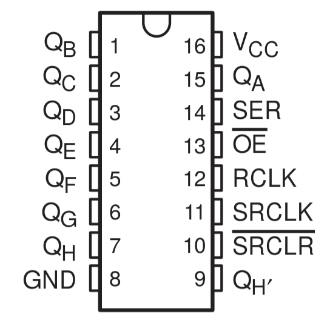
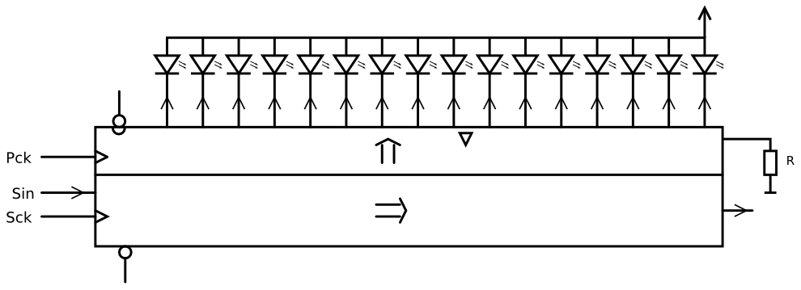

% Registre d'extension série-parallèle
% [Pierre-Yves Rochat](mailto:pyr@pyr.ch), EPFL
% rév 2015/09/18

## Besoin de broches ###

Les enseignes et surtout les afficheurs à LED nécessitent beaucoup de broches dont on peut commander l'état. Les microcontrôleurs n'ont généralement pas assez de broches d'entrées-sorties pour faire face à ce besoin. Plusieurs circuits logiques classiques offrent la fonctionnalité de fournir des sorties supplémentaires. Notons par exemple les *latch adressables*, qui sont très pratiques. Le circuit 74HC259 est un latch adressable à 8 sorties.

Mais le composant le plus souvent utilisé dans le domaine des afficheurs à LED est le *registre série-parallèle*.

## Registre série ##

Les registres à décalage sont réalisés avec des bascules. Voici le schéma d'un registre série 8 bits :

On y trouve 8 bascules D. Les horloges des 8 bascules sont reliées ensemble. L'entrée D de la première bascule est l'entrée de notre registre. Sa sortie est reliée à l'entrée de la seconde bascule et ainsi de suite. Le système a 8 sorties.

Voici un diagramme des temps qui permet de comprendre comment fonctionne ce registre. Pour chaque bascule D, la valeur de l'entrée est copiée sur la sortie au moment du flanc montant de l'horloge.

Les valeurs notées 0,1,2..7 correspondent à des valeurs binaires 0 ou 1 placées successivement sur l'entrée. Ces valeurs vont se décaler d'une bascule vers la suivante, à chaque coup d'horloge. Après 8 coups d'horloge, les 8 valeurs envoyées en série vont se retrouver sur les sorties. Il est donc possible par ce moyen de placer n'importe quelle valeur sur les 8 sorties.

Ce dispositif permet donc de disposer 8 sorties, tout en ne monopolisant que 2 broches du microcontrôleur. Mais il a un problème majeur : durant le transfert des données, des valeurs non désirées vont apparaître sur les sorties. Dans certains cas particuliers, ce n'est pas grave. Mais c'est souvent inacceptable. Dans le cas de la commande de LED, l'œil est très sensible et des artefacts sur les LED deviennent vite gênants.

## Registre série-parallèle ##

Ajoutons 8 bascules D supplémentaires à notre montage. Ces 8 bascules forment cette fois un registre parallèle, avec 8 entrées et 8 sorties. Comme pour le registre série, les horloges des 8 bascules sont reliées ensemble.

Sur ce diagramme des temps, on voit que les données transmises en série sont ensuite copiées sur les sorties du registre parallèle.

Les 8 valeurs arrivent en même temps sur les sorties du registre parallèle. Les anciennes valeurs sont présentes sur toutes les sorties durant le transfert série et sont mises à jour en même temps. Il n'y a donc pas de risque d'artefacts. 

## Le circuit 74HC595 ##

Le circuit 74HC595 est très souvent présent dans des afficheurs à LED. C'est un circuit C-MOS, de la série 74HCxx. Il comporte un registre série-parallèle de 8 bits. Ses sorties sont à *trois états*, commandées par le signal Output Enable. Une entrée Reset permet de forcer les valeurs du registre de sortie à zéro.

Sa sortie série permet de cascader les circuits, c'est-à-dire les placer les uns à la suites des autres, comme le montre la figure suivante :

Pour ce faire, les horloges doivent être communes à tous les registres : l'horloge série, notée __*Sck*__ et l'horloge parallèle, notée __*PCk*__. La sortie du premier registre est reliée à l'entrée du deuxième et ainsi de suite. Il est possible de créer de très longs registres. Quelle que soit la longueur du registre, seules trois sorties du microcontrôleur sont nécessaires pour le commander. Si le nombre de registre est vraiment important, il sera judicieux de placer un amplificateur sur les horloges avant de les transmettre au registre suivant. Dans beaucoup d'afficheurs à LED, on trouve des 74HC245 qui jouent ce rôle. Il s'agit de passeurs bi-directionnels, qui ne sont utilisés dans ce cas que dans un sens.

## Registres à sorties à courant constant ##

Bien entendu, les sorties du 74HC595 sont des sorties C-MOS normales. Pour les utiliser pour commander des LED, il faut ajouter en série avec chaque LED la traditionnelle résistance pour limiter le courant.

Il existe plusieurs circuits registres série-parallèles dont les sorties incorporent des sources de courant. Il est ainsi possible de brancher des LED sans la résistance série, ce qui simplifie le schéma :

La valeur du courant dans toutes les sorties est fixé par une seule résistance, notée R sur le schéma. 

Plusieurs fabricants proposent différents modèles de registres série-parallèle avec sources de courant. Parmi les circuits 16 bits, on en trouve un bon  nombre dont les noms sont différents, mais qui ont en commun leur brochage. Toshiba propose le TB62701, Texas Instrument le TLC5905, Allegro le A6276, etc. Un fabricant chinois propose le SUM2016, dont je n'ai trouvé la documentation... qu'en chinois !

## Programmation ##

La procédure pour envoyer 8 bits dans notre registre série parallèle est constituée d'une boucle `for`, répétée autant de fois qu'il y a de bits dans le registre. La valeur binaire à transmettre est d'abord placée sur une sortie, puis un flanc montant est produit sur l'horloge. L'horloge repasse ensuite à 0 pour être prête pour l'envoi de la valeur suivante. Tout à la fin, une impulsion est envoyée sur l'horloge parallèle.

~~~~~~~ { .c .numberLines startFrom="1" }
#define SortieSerieOn P1OUT |= (1<<0)
#define SortieSerieOff P1OUT &=~(1<<0)

#define ClockSerHaut P1OUT |= (1<<1)
#define ClockSerBas P1OUT &=~(1<<1)

#define ClockParHaut P1OUT |= (1<<2)
#define ClockParBas P1OUT &=~(1<<2)

void Envoie8bitsSerie (uint8_t valeur) {
  uint16_t i;
  for (i=0; i<8; i++) {
    if (valeur & (1<<i)) {
      SortieSerieOn;
    } else {
      SortieSerieOff;
    }
    ClockSerHaut; ClockSerBas;
  }
  ClockParHaut; ClockParBas;
}
~~~~~~~
<!-- retour au mode normal pour l'éditeur -->

Cette procédure devient souvent la procédure centrale dans un programme qui gère un afficheur à LED, celle qui consomme le plus de temps . Il faut l'écrire avec soin, en allant même jusqu'à regarder comment le compilateur l'a traduite en instructions assembleur, pour chercher à optimiser le code pour une exécution aussi rapide que possible.

Voici par exemple une version plus optimisée de l'envoi des bits :

~~~~~~~ { .c .numberLines startFrom="11" }
...
  for (i=0; i<8; i++) {
    if (valeur & (1<<0)) {
      SortieSerieOn;
    } else {
      SortieSerieOff;
    }
    ClockSerHaut; ClockSerBas;
    valeur = valeur >> 1;
...
~~~~~~~
<!-- retour au mode normal pour l'éditeur -->

Cette version supprime l'opération `valeur & (1<<i)`, qui prend davantage de cycles d'horloge du microprocesseur que l'instruction `valeur & (1<<0)`.

Ce n'est qu'un petit exemple d'optimisation. Une autre technique sera décrite plus loin dans ce cours : il s'agit de l'Accès Direct en Mémoire (Direct Memory Access = DMA). Dans ce cas, ce n'est plus le microcontrôleur qui va effectuer le travail d'envoi des bits, mais un contrôleur spécialisé, disponible dans certains microcontrôleurs comme les ARM.

