**Logique séquentielle en vhdl **
==========================

## [Mamadou Lamine Ndiaye](mailto:mamadoulamine.ndiaye@ucad.edu.sn), ESP Dakar

> Document en cours de relecture, version du 2015/01/25

## Instructions séquentielles en VHDL ##

#### Introduction ####

Les instructions séquentielles sont exécutées les unes après les autres, l’ordre d’écriture est très important contrairement aux instructions concurrentes. Les instructions séquentielles sont réalisées par le biais de processus (PROCESS). Plusieurs PROCESS peuvent s’exécuter en parallèles dans une architecture. Toutes les instructions concurrentes sont en réalité des processus. Un processus peut avoir des variables locales.

#### Les PROCESS ####
Les instructions séquentielles permettent de modéliser des comportements procéduraux constitués d'un suite d'action à exécuter en séquence. Les instructions séquentielles ne peuvent être utilisées que dans le corps d'un processus ou d'un sous-programme.
Les instructions séquentielles du VHDL sont très évoluées à l’image des langages de haut niveau.

On les utilise dans un process, les instructions s’exécutent suivant l’ordre d’écriture.
Plusieurs process peuvent s’exécuter en parallèle dans une même architecture; le déroulement est SEQUENTIELLE (ordre d’écriture des instructions).

Un process peut contenir des parties combinatoires, des parties séquentielles.
 Un process est activé lors d’un changement d’état d’un des signaux de la liste de sensibilité
 Les instructions utilisables dans un PROCESS sont SPECIFIQUE (pas d’instructions concurrentes)
 Les signaux sont mis à jour uniquement à la fin du process

Un processus peut avoir des variables locales. Le fonctionnement du processus est régi par les règles suivantes :
Un processus est une boucle infinie, il recommence automatiquement à la fin du process. 
Un processus doit être synchronisé par des points d'arrêt qui sont :

* Une “liste de sensibilité” (process(liste de signaux)) qui contient une liste de signaux qui réveillent le processus lors d'un changement d'un des signaux.
* Des instructions d'arrêt wait dans sa description interne. Le wait est sensible soit à un signal soit à un temps.

 

L’instruction séquentielle wait peut prendre plusieurs formes :

* wait on signal; qui utilise les signaux de la liste de sensibilité
* wait for temps qui utilise un délai d’attente
* wait until conditions qui utilise la condition spécifiée
* wait on signal until conditions for temps qui représente la forme générale.

 

La partie exécutable d'un processus n’est activée que si un changement d'état survient sur au moins un signal de sa liste de sensibilité.
L'instruction séquentielle wait peut prendre plusieurs formes:

* La forme wait : attente d’un signal parmi la liste de sensibilité.
* La forme wait for permet d’attendre un temps
* La forme wait until permet d’attendre une condition spécifiée.
* La forme générale wait on ...  until ... for … représente la forme générale

## Les instructions de contrôle ##

#### Instruction IF ####

 Elle est classique comme dans tous les langages de programmation
 If … then …; [ elsif …then]  ; [ else …] ; end if;
 Toute  instruction if doit se terminer par un end if;

 

#### Instruction CASE .. IS ####

Cette  instruction permet de sélectionner une séquence d’instruction en fonction de la valeur d’une expression.
Tous les cas doivent être traités , on utilisera ainsi la directive  when others pour lister les différents cas possibles.
Elle est souvent utilisée pour la description de machines d’état ou toute fonction de type  tables de vérité.

 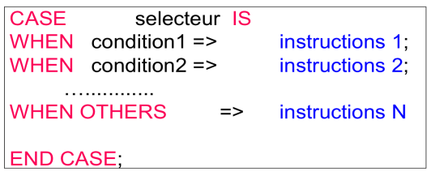

#### Instruction LOOP ####

Les instructions de boucle (LOOP) permettent de décrire des comportements répétitifs, elles peuvent prendre ces trois formes :

* La boucle for permet d'effectuer un nombre fini d'itérations.
* La boucle while permet d'effectuer des itérations de manière conditionnelle.
* La boucle générale permet de décrire des boucles infinies.

 

Il y  a la possibilité d’utiliser les instructions next et exit pour contrôler le comportement de la boucle:

* L'instruction Next stoppe l'itération courante et démarre l'itération suivante.
* L'instruction exit stoppe l'itération et sort de la boucle.

## Applications instructions séquentielles ##

#### Bascule RS ####

La bascule RS présente une entrée R (Reset) de forçage à 0 et une entrée S (Set) de forçage à 1. Une structure de la bascule proposée par ce logigramme utilise des portes AND et des portes NOR.

 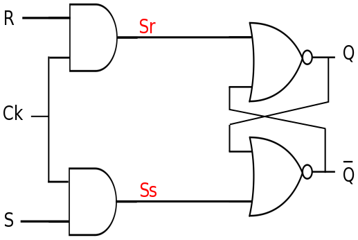

La synthèse en VHDL utilise quatre signaux internes Sr, Ss qui prennent respectivement les valeurs de R, S lorsque l’horloge Ck vaut 1 (front montant). Les deux autres signaux internes Qa et Qb sont affectés aux sorties de la bascule à la fin du PROCESS.

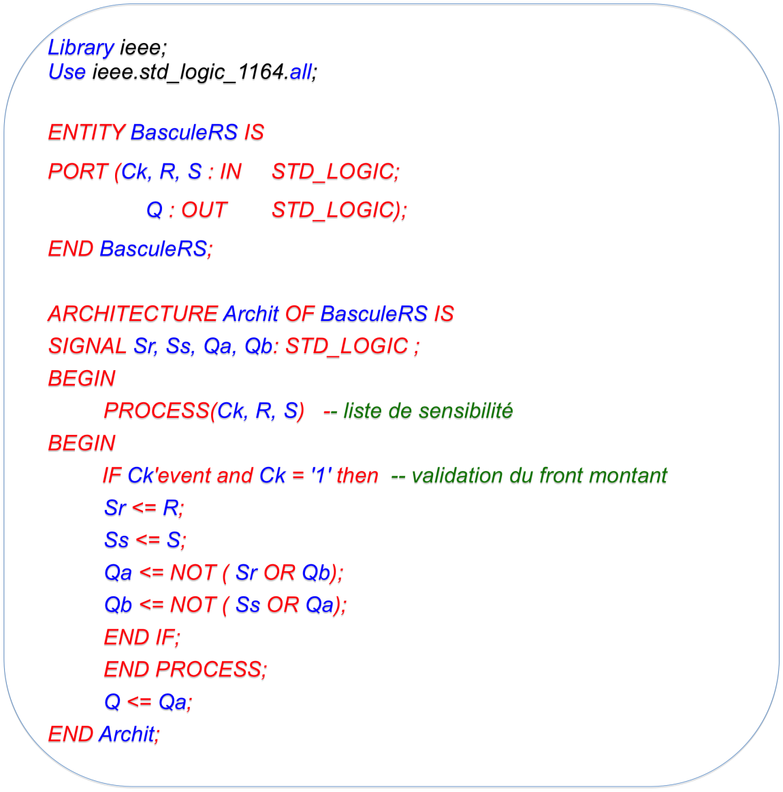

La bascule est activée sur front montant de l’horloge, l’instruction Ck'event est utilisée pour détecter l’événement sur Ck. Cette instruction est une fonction de type boolean qui vaut TRUE si un événement est détecté sur Ck. Ck'event and Ck = '1 permet ainsi de détecter un front montant sur Ck, c’est équivalent à l’instruction rising_edge(Ck).

#### Bascule D ####

La sortie Q prend donc l'état de l'entrée D sur front montant de l'horloge (Ck)

 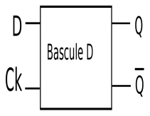

 

La bascule D avec entrées de forçage SET et RESET.

 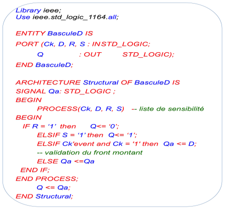

#### Bascule JK ####

Lorsque J = K = 0, la bascule JK conserve le dernier état indépendamment de l'horloge : mémorisation.
Lorsque J = K = 1, la sorite Q de la bascule JK bascule à chaque front d'horloge.
Lorsque J différent de K, la sortie Q de la bascule JK recopie l'entrée J à chaque front d'horloge.

 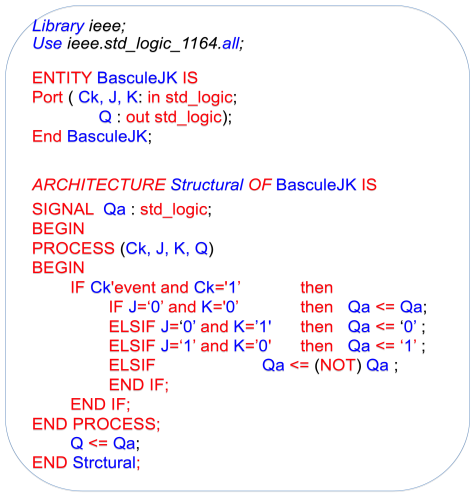

#### Compteur modulo 10 ####

Un compteur est un système séquentiel qui permet de dénombrer des impulsions appliquées sur son entrée  d'horloge (ck : clock ).

#### Compteur modulo 10 (Gestion de la fréquence du comptage) ####

Comme les systèmes numériques qui réalisent le comptage fonctionnent à des fréquences très élevées, il faut réduire la fréquence pour qu’une personne puissent apprécier la fréquence de comptage. Le principe consiste à diviser la fréquence.
Si nous prenons l’exemple d’un circuit numérique fonctionnant à une fréquence de l’horloge de 50 Mhz et si nous souhaitons compter à une fréquence de 3 Hz, il faut compter le nombre d’impulsion de l’horloge correspondant à 3 Hz (c’est à dire 500000000:3)  avant d’incrémenter le compteur. Le nombre de bit nécessaire pour représenter le nombre d’impulsion de l’horloge à compter avant d’incrémenter le compteur est de 24 bits.

 

#### Compteur modulo N ####

L’objectif ici est de réaliser un compteur modulo 1000 (de 0 à 999), il faut 3 chiffres Q0, Q1, Q2. Q0 étant le chiffre unité et Q2 le chiffre centaine. Lorsque le chiffre unité atteint la valeur 9, alors le chiffre dizaine est incrémenté et le chiffre unité est remis à 0. Lorsque le chiffre dizaine atteint la valeur 9, alors le chiffre centaine est incrémenté et le chiffre dizaine est remis à 0.

 

Question :
 Quelle est la fréquence de comptage si la fréquence de l’horloge est de 50 Mhz ?

#### Registre à décalage série parallèle ####

Dans un registre à décalage les bascules sont interconnectées de façon à ce que l'état logique de la bascule de rang i puisse être transmis à la bascule de rang i+1 quand un signal d'horloge est appliqué à l'ensemble des bascules.

Ce type de registre permet de transformer un codage temporel (succession des bits dans le temps) en un codage spatial (information stockée en mémoire statique).

 

 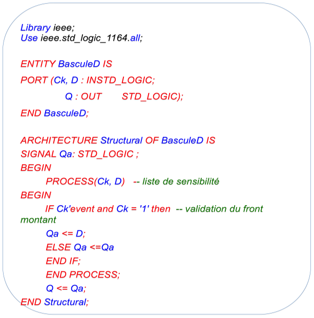

Le registre à décalage est réalisé à partir de la bascule D.

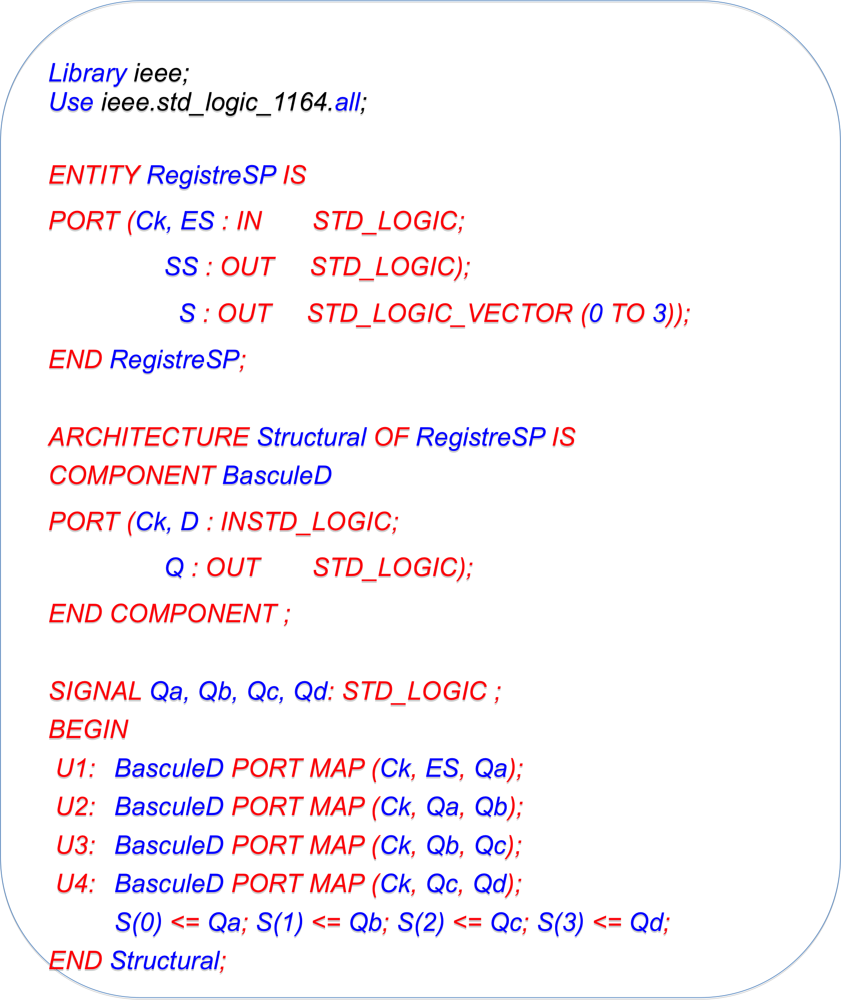

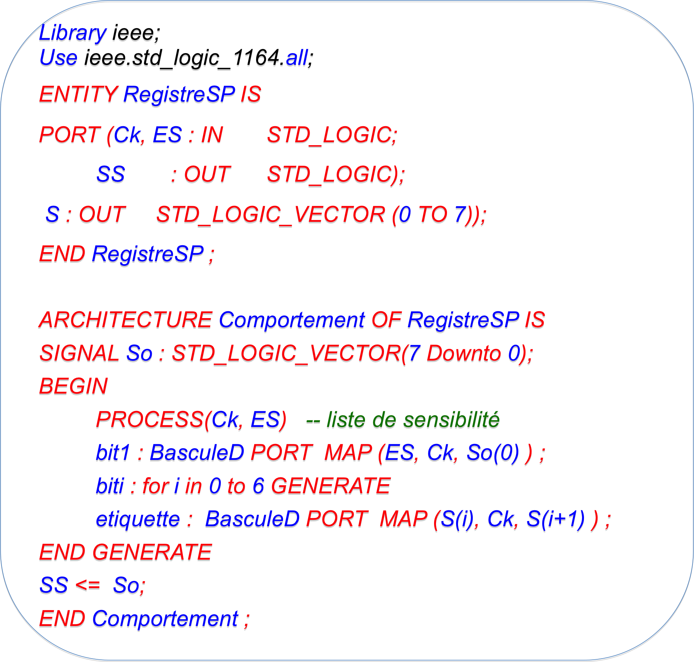

#### Les machines d’états ####

Une machine d’états sont très utilisées pour modéliser les séquences complexes, elle est équivalente à un automate ou à un grafcet qui permet de représenter les états stable d’un système (équivalent aux étapes d’un grafcet). La machine peut évoluer vers un autre état stable en fonction des entrées. Chaque état correspond à des sorties actives ( les actions associées aux étapes). Il existe deux grands types de machines d’états:

* Les machines dites de MOORE
* Les machines de MEALY

Pour la machine de MOORE la sortie ne dépend que de l’état courant

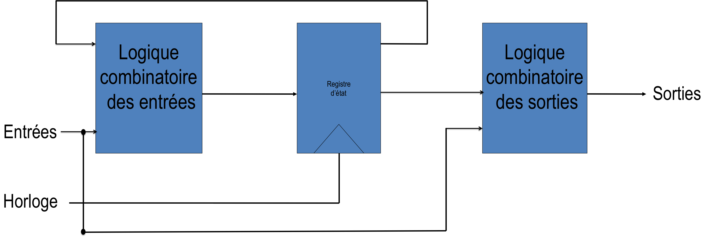

Pour la machine de MEALY la sortie dépend que l’état courant et des entrées

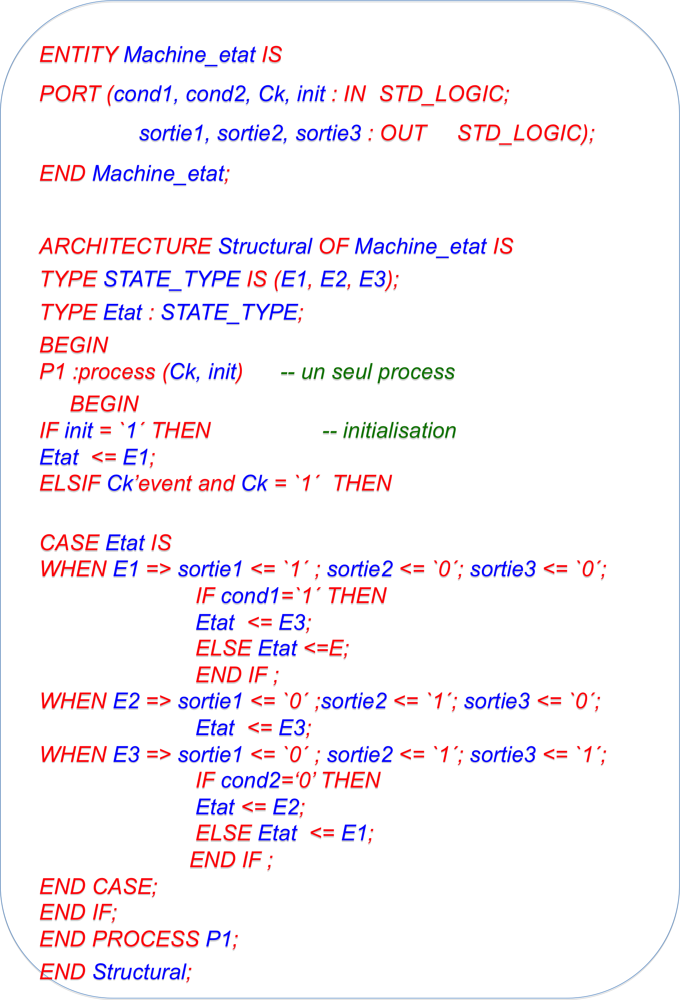

