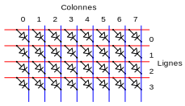

% Afficheurs matriciels multiplexés
% [Pierre-Yves Rochat](mailto:pyr@pyr.ch), EPFL
% rév 2016/03/09

## Afficheur matriciel et schéma de commande ###

Le schéma classique d’un afficheur matriciel nécessite simplement une sortie de registre par LED, comme le rappelle ce schéma :

{ width=95% }

L'envoi des données dans les registres série-parallèle se fait selon le diagramme des temps suivant :

{ width=70% }

Lorsque le nombre de LED augmente, le nombre de registres augmente aussi. Ainsi un afficheur de 32 fois 32 pixels nécessite 1024 sorties de registre. En utilisant le registre classique 74HC595, il faut 128 circuits intégrés et 1024 résistances. Et ces nombres sont multipliés par 3 pour un afficheurs couleur RGB, où un pixel est formé de trois LED.

Avec l’usage de registres à 16 sorties du type SUM2016, dont les sorties sont à courant constant, une matrice de 32 x 32 pixels RGB nécessitera tout de même 64 circuits intégrés et 64 résistances.

Il existe une solution qui limite beaucoup le nombre des registres : c’est l’usage du multiplexage temporel. Notons dès maintenant que cette solution aura des conséquences sur la luminosité de l’afficheur et sur la complexité du programme de commande.

## Multiplexage temporel ##

Pour illustrer plus simplement notre propos, choisissons de réaliser un petit afficheur matriciel de 4 lignes de 8 pixels.Voici comment les LED vont être connectées :

{ width=70% }

Il est impossible d'allumer en même temps certaines LED sans en allumer d'autre LED non souhaitées. Dans l'exemple suivant, on souhaite allumer les LED (1,1) et (3,2). En alimentant les lignes et colonnes correspondantes, on voit qu'on allume aussi les LED (3,1) et (1,2) :

{ width=70% }

Mais il est possible de commander cette matrice de LED selon le principe du multiplexage temporel, présenté dans une leçon précédente. Le multiplexage temporel consiste à afficher successivement certaines parties de l’afficheur, à une vitesse telle que l’œil ne s’en rende pas compte. Voici le diagramme des temps correspondant :

{ width=100% }

Pour un cycle complet de la matrice, le registres série-parallèle doit être chargé pour chacune des lignes, nécessitant chaque fois huit coups d'horloge série et un coup d'horloge parallèle. Une fois les données d'une ligne présentes sur la sortie du registre, les anodes de la ligne correspondante doit être sélectionnée. Pour un raffraîchissement de la matrice à 100 Hz, il faudra prévoir un temps d'affichage de chacune des quatre lignes de 25 ms.

Voici un schéma permettant de réaliser notre afficheur multiplexé :

{ width=70% }

Ou voit que le nombre de registres a diminué : dans ce cas, il n’en reste qu’un. Par contre, il est nécessaire de pouvoir sélectionner les lignes séparément. Il est nécessaire de placer un élément d’amplification, pour pouvoir fournir un courant suffisant pour toutes les LED de la ligne. Nous avons utilisé ici un transistors PNP.

Notons que dans ce montage, tous les signaux sont actifs à zéro. En effet, c'est bien une tension de 0 V qui permet de faire conduire le transistor PNP, en appliquant une tension négative entre sa base et son émetteur. C'est aussi une tension négative à la sortie du registre qui va allumer la LED correspondante sur la ligne sélectionnée.

## Multiplexeur ##

Pour éviter le grand nombre de signaux de sélection des lignes, un multiplexeur est souvent utilisé. Ce circuit combinatoire est aussi appelé un décodeur. Ses entrées correspondent aux valeurs binaires. Une seule de ses sorties peut être activée à un instant donné. Le circuit intégré 74HC138 est très souvent utilisé :

{ width=40% }

Le fait que les sorties soient actives à zéro convient bien pour la commande des transistors PNP. L'entrée **OE** (*Output Enable*) permet d'activer l'affichage.

## Courant nominal et courant maximal ##

Le multiplexage offre une diminution du nombre de composants nécessaires à l’électronique de commande, mais il diminue l’intensité résultante de l’afficheur. Cet effet est en partie limité par l'augmentation du courant dans les LED. En effet, on peut jouer sur le fait que le courant nominal des LED peut être dépassé lorsque que ce courant n’est pas permanent, ce qui est toujours le cas sur un afficheur multiplexé. Le courant pouvant aller jusqu’à une valeur proche du courant maximal, l’intensité instantanée est sensiblement augmentée. On utilise très souvent 150% du courant nominal.

## Comparaisons des architectures ##

Un multiplexage par deux ne perd que très peu d’intensité. Il était très souvent utilisé dans les modules constituant les panneaux utilisés pour les écran vidéos géants, allant jusqu’à plusieurs dizaines de mètres carrés. Il divise pas deux le nombre de registres, mais nécessite l'usage de transistors sur les anodes. Avec la baisse du prix des registres, cette solution est de moins en moins utilisée.

Par contre, les valeurs 4, 8 et 16 se rencontrent fréquemment, vu que le prix de revient d’un module diminue lorsque le chiffre du multiplexage augmente. Mais il faut bien rester conscient de l’incidence du multiplexage sur la luminosité de l’afficheur, en particulier lorsque celui-ci doit être utilisé à l'extérieur (*outdoor*). 

## Programmation ##

Le programmation des afficheurs matriciels multiplexés est similaire à cette des afficheurs matriciels non-multiplexés. On utilise le principe de génération - raffraîchssement.

Avec un afficheur non multiplexé, il suffit d'attendre pour laisser affiché un motif un certain temps. Par contre, pour un afficheur multiplexé, il est nécessaire d'exécuter des cycles d'affichage en permanence, même si le contenu le change pas.

Nous pouvons donc centrer notre programme sur une procédure qui effectue un cycle complet d'affichage des lignes de l'affichaur. La durée d'un cycle étant constante, par exemple environ 10 ms pour un raffraichissement à 100 Hz. Le temps d'exécution de cette procédure peut donc devenir la base de temps pour le séquencement des animations.

Pour faciliter l'écriture du programme, on passe le nombre de cycles à exécuter à la procédure d'affichage :

~~~~~~~ { .c .numberLines startFrom="1" }
void CyclesMatrice(uint16_t nbCycles) {
  uint16_t n, x, y;
  for (n=0; n<nbCycles; n++) {
    for (i=0; i<4; i++) { // envoi et affichage des 4 lignes
      for (i=0; i<4; i++) { // envoi et affichage des 4 lignes
        if (
          SerClockSet; SerClockClear; // envoie un coup d'horloge série
        }
	ParCloclSet; ParClockClear; // envoie un coup d'horloge
        AttenteLigne(); // affichage de la ligne
      }
    }
  }
}
~~~~~~~
<!-- retour au mode normal pour l'éditeur -->

Pour le reste, la programmation d'un afficheur multiplexé est la même que celle d'un afficheur non multiplexé. Par exemple, la procédure qui affiche un point qui rebondit sur les bords devient la suivante :

~~~~~~~ { .c .numberLines startFrom="1" }
void Ping() {
  int16_t x=0;
  int16_t y=0;
  int8_t sensX=1;
  int8_t sensY=1;
  do {
    AllumePoint(x,y);
    CyclesMatrice(DELAI); // l'affichage fait office de délai
    EteintPoint(x,y);
    x+=sensX;
    if(x==(MaxX-1)) sensX=(-1);
    if(x==0) sensX=1;
    y+=sensY;
    if(y==(MaxY-1)) sensY=(-1);
    if(y==0) sensY=1;
  } while (!((x==0)&&(y==0)));
}
~~~~~~~
<!-- retour au mode normal pour l'éditeur -->

Les deux lignes :

~~~~~~~ { .c .numberLines startFrom="1" }
    AfficheMatrice();
    Attente(DELAI);
~~~~~~~

sont remplacées par :

~~~~~~~ { .c .numberLines startFrom="1" }
    CycleMatrice(DELAI);
~~~~~~~

où le délai est exprimé en nombre de fois le temps du cycle, par exemple 10 ms.

