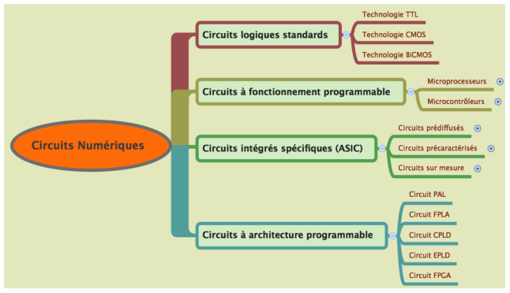
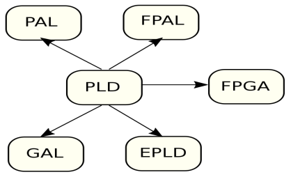
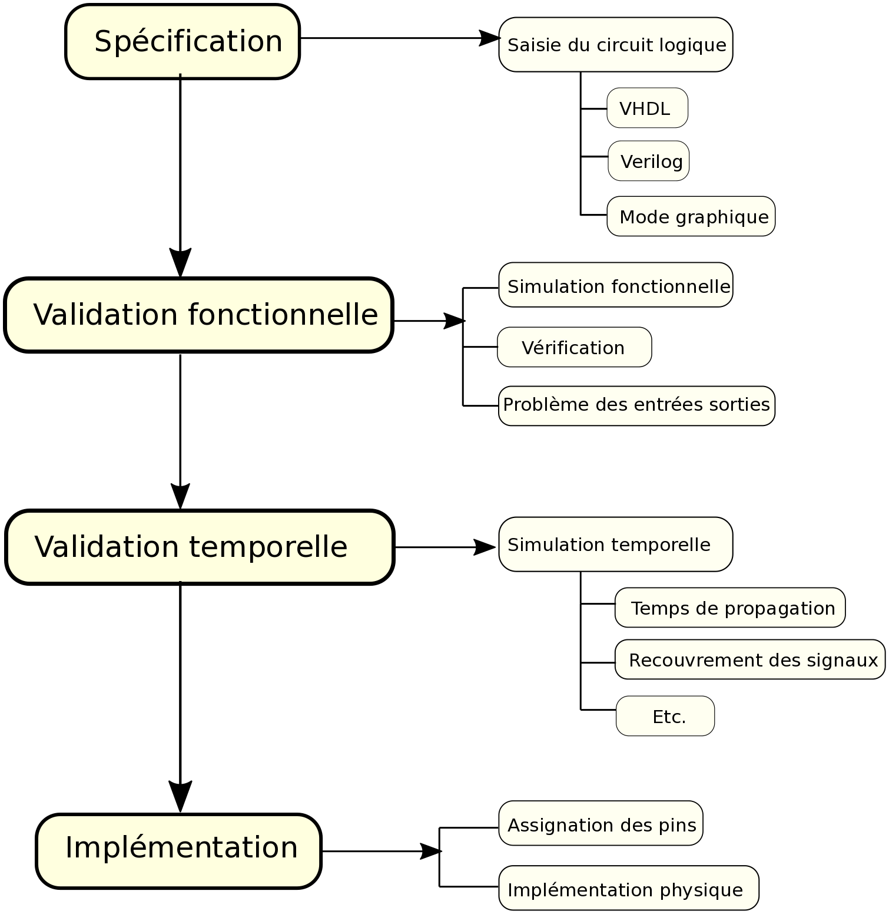
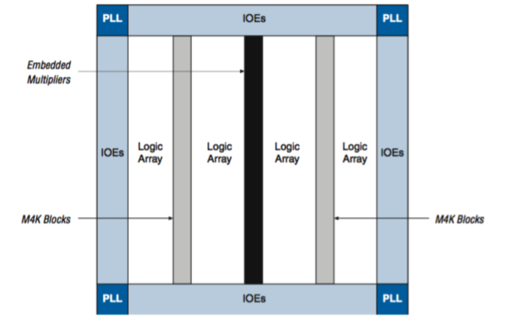
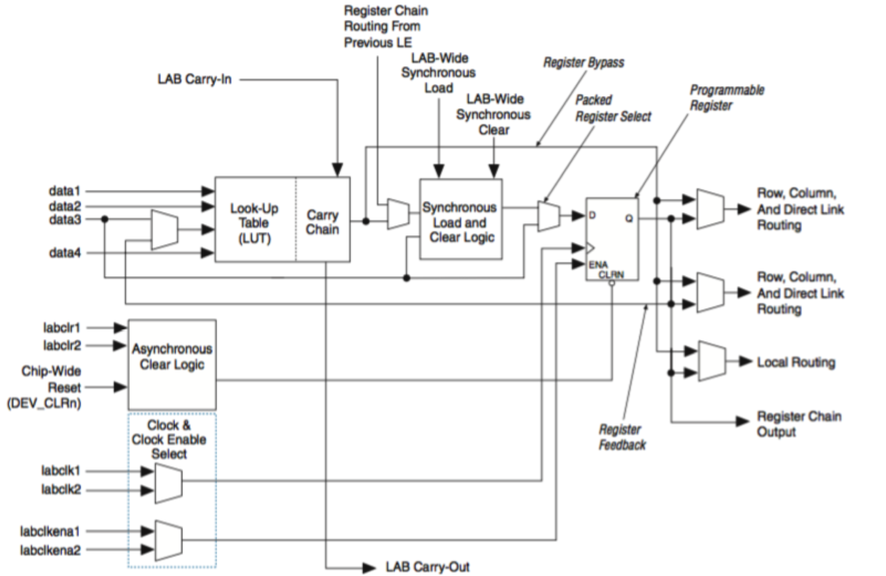
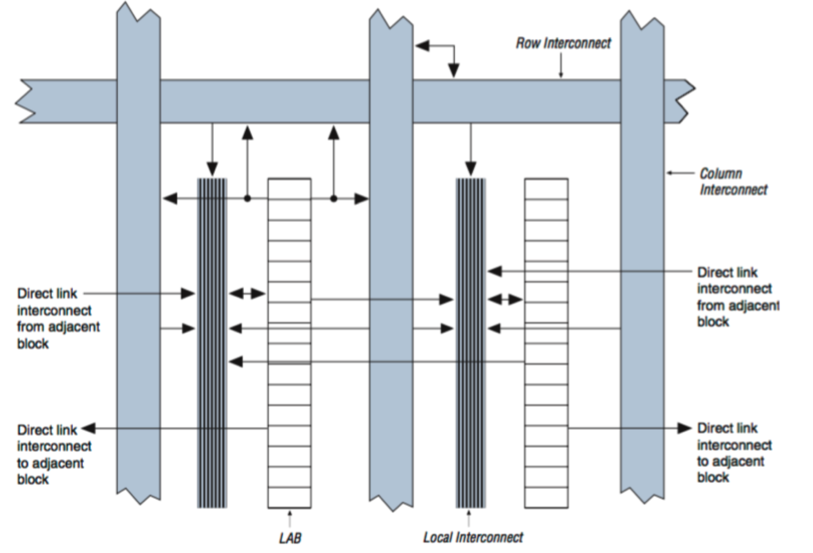
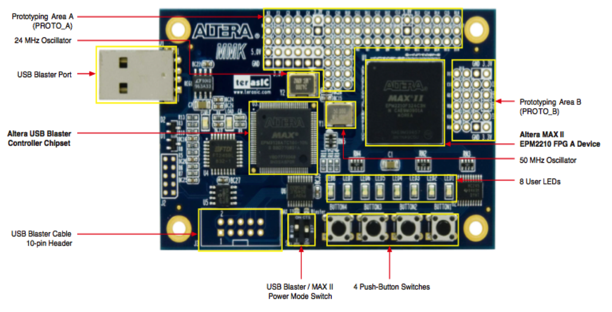
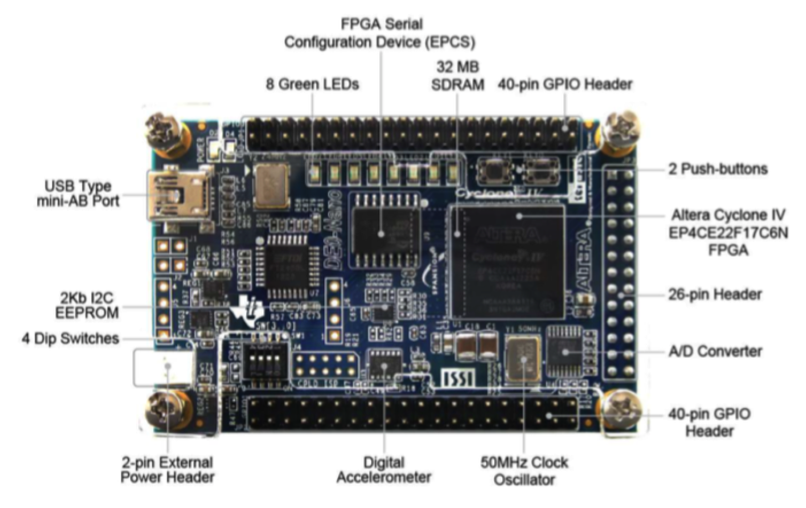
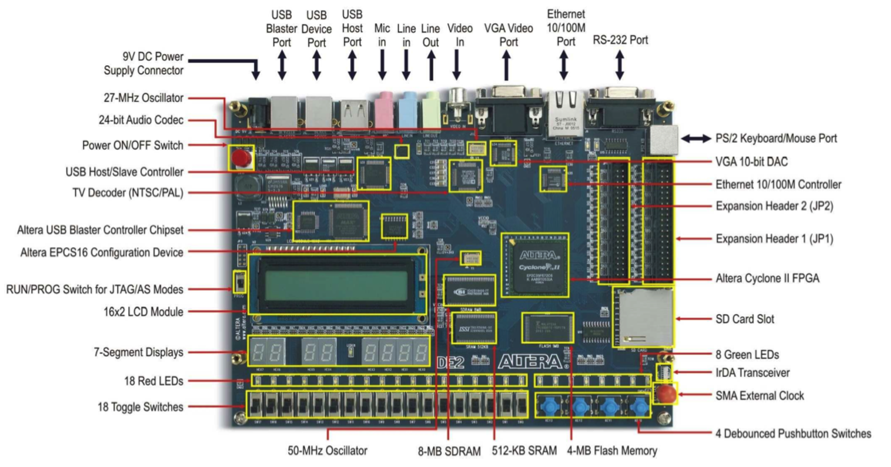

**Circuits numériques programmables : FPGA**
==========================

## [Mamadou Lamine Ndiaye](mailto:mamadoulamine.ndiaye@ucad.edu.sn), ESP Dakar

> Document en cours de relecture, version du 2015/01/25

## Circuits numériques ##

#### Classification des circuits numériques ####

Les circuits numériques peuvent être classés en quatre catégories:

 

Les circuits logiques standards dominés aujourd’hui par la technologie CMOS. Les circuits à fonctionnement programmables où on peut regrouper tous les processeurs (microprocesseurs, microcontrôleurs, DSP).
Les circuits intégrés spécifiques (ASIC) où on peut citer les  circuits pré-diffusés qui intègrent des  réseaux de cellules logiques à base de transistors implantés mais non interconnectés. En fonction de l’application visée, l’interconnexion des cellules logiques permet de personnaliser le circuit.
Les circuits précarctérisés constituent un assemblage de fonctions prédéfinies et précaractérisées électriquement par le fabricant (éléments de bibliothèques)
Les circuits sur mesure représente une solution optimale en termes de densité et de performance adaptée aux exigences du client (l’utilisateur) .
Les ASICs présentent l’avantage de garantir les performances maximales mais ont un temps de développement long et un coût de développement en augmentation.

Les circuits logiques programmables sont constitués d’un ensemble de portes logiques (ou cellules logiques) reliées par des interconnexions reconfigurables. Les reconfigurations se font par des ET, OU, Bascules, RAM, multiplexeurs, registres, etc.  Plusieurs sigles existent pour désigner les circuits logiques programmables. Le terme programmation ici est au sens reconfiguration des interconnexions. Il existe des circuits reconfigurables une seule fois avec la technologie anti-fusible ou plusieurs fois avec les technologies FLASH, EEPROM, SRAM
Ces différents termes permettent de désigner la technologie des interconnexions. En effet dans les  circuits PAL les interconnexion se font à base de fusible, les EPLD utilise une technologie FLASH et les FPGA utilise des mémoires RAM.

#### Les circuits logiques programmables (PLD) ####

Les différents sigles des circuits logiques programmables sont :

* Les PAL (Programmable Array Logic)  sont des circuits logiques programmables dans lesquels seules les fonctions ET sont programmables, les fonctions OU ne le sont pas.
* Les GAL (Generic Array Logic)  sont des circuits logiques PAL reprogrammables à technologie CMOS.
* Les FPLA (Field Programmable Logic-Array)  sont des circuits logiques programmables dans lesquels les fonctions ET et les fonctions OU sont programmables.
* Les EPLD (Erasable Programmable Logic Device)  sont des circuits logiques reprogrammables.
* Les FPGA (Field Programmable Gate Array)  sont des réseaux de portes programmables à la demande. L’utilisateur réalise les interconnexions nécessaires par programmation (reconfiguration).

#### Les circuits FPGA ####

Les FPGA sont constitués de blocs logiques appelés cellules qui sont des portes logiques, des SRAM, des bascules, etc et un réseau de fils de connexion que l’on peut assembler par programmation avec des AND, OR, registres, etc. Chaque constructeur définit son propre bloc logique.

Les portes logiques et autres composants sont réparties dans le circuit de manière ordonnée, en groupes appelés blocs logiques configurables. Synthètiser une fonction logique revient à interconnecter  un certain nombre de blocs logiques (mapping), puis reliées les uns aux autres par des fils de connexions (routage).

Les circuits logiques programmables de type FPGA sont très utilisés  dans la conception des circuits logiques. Ils présentent les avantages suivants:

* Ils permettent une reprogrammation à volonté, ils permettent de d’analyser différents algorithmes en un temps très court.
* Ils offrent une grande souplesse qui autorise des évolutions rapides à moindre coût.
* Leurs densités d’intégration peuvent atteindre plus de 10 millions de portes logiques.
* Ils offrent la possibilité de traitement parallèle des données (augmentation de la vitesse de calcul).
* La capacité est limitée par le nombre de blocs logiques configurables (non la complexité).

Les FPGA sont inventés par XILINX qui sont leaders sur le marché (49%).
ALTERA a une part de marché de prés de plus de 40%.

#### Méthodologie de conception  ####

Plusieurs niveaux de description existent pour synthétiser un circuit logique:

* Un modèle peut être décrit par son comportement ou son fonctionnement qui décrit un modèle par, sa fonction, son algorithme. Il s’agit d’utiliser des instructions d’un langage de programmation pour décrire comment cela fonctionne.
* La description par RTL (RTL « Register Transfert Logic ») revient à décrire l’implémentation sous forme d’éléments séquentiels en prenant en compte  la notion d’horloge , de cycle;
* La description par les portes logiques (Structurel) utilise la topologie (netlist) de portes logiques, de registres, de composants, etc. pour réaliser le circuit.

La méthodologie de conception d’un circuit logique avec les FPGA se décline en quatre étapes:

* La spécification qui consiste à la saisie du circuit logique soit de manière syntaxique, ou de manière graphique ou par diagramme.
* La validation fonctionnelle qui consiste à la vérification de schéma ou de synthaxe et des simulations comportementales
* La validation temporelle qui tient compte des temps de propagation et des problèmes de recouvrement des signaux
* L’implémentation sur la cible consiste à faire l’assignation des pins et d’envoyer le programme sur la cible.

#### Environnement de développement  ####

La Synthèse des circuits logiques avec les FPGA s’appuie principalement sur leux principaux plateformes de développement

* Altera Quartus II
* Xilinx ISE

Quartus est un logiciel développé par la société Altera pour la conception, la simulation, la synthèse et l’implémentation de circuits numériques. Le logiciel permet la spécification en mode graphique, par description HDL(VHDL ou Verilog) des circuits logiques.
Xilink ISE est un logiciel développé par la société Xilink

##### Présentation du CYCLONE II  #####

Le CYLONE II d’ALTERA est un FPGA qui Compte de 68416 éléments logiques  regroupés par blocs de 16.

Le CYLONE II compte quatre boucles à verrouillage de phase (PLL). Les blocs logiques disposent d’éléments d’entrée-sorties, de multiplicateurs embarqués, et de blocs mémoire embarquée. La configuration rapide du circuit peut se faire en moins de 100ms. Il intègre le mode de configuration série USB BLASTER ou JTAG

Un élément logique du Cyclone II dispose de 4 entrées permettant représenter n’importe quelle fonction logique à 4 entrées, d’un registre de sortie programmable, d’une entrée de retenue provenant de l’élément logique précèdent et d’une sortie de retenue pour l’élément suivant.
Un élément logique dispose également de lien d’interconnexion local, ligne colonne, direct, de registre.

Un bloc logique est constitué de 16 éléments logiques. Un réseau local d’interconnexion permet  la communication entre EL d’un même bloc. Les liaisons directs permettent l’interconnexion des BL adjacents, il existe aussi un bloc mémoire,  un signal d’horloge, un multiplieur et entrée sortie entre bloc adjacent. Un réseaux d’interconnexion ligne colonne existe entre BL.

#### Environnement de Travail  ####

Notre environnement de travail est constitué d’un logiciel, d’une carte de développement, d’une matrice à LED et éventuellement d’un simulateur.

QUARTUS II Web Edition : est un logiciel permettant le développement jusqu’à l’implémentation sur la carte FPGA. Il est à téléchargement gratuit sur www.altera.com. Un modèle du simulateur ModelSim existe avec ALTERA ModelSim-Altera Web Edition.

Nous travaillerons avec les cartes de développement DE0 et DE2 d’ALTERA.

##### Carte DE0 NANO (MAX II)  #####

Specifications   FPGA

* Altera MAX II EPM2210F324 FPGA device

I/O Devices

* Built-in USB Blaster for FPGA configuration

Switches, LEDs, Displays, and Clocks

* 1 DIP switche
* 4 pushbutton switches
* 2 red user LEDs,
* 2 yellow user LEDs,
* 2 blue user LEDs,
* 2  green user LEDs
* 50-MHz oscillator for clock sources
* Powered by USB

Prototyping Areas
A 40-pin expansion port area compatible with Altera DE2/DE1 expansion ports.
Prototyping Area A with 68 GPIO, 6 3.3V, 2 5V and 8 GND pins
Prototyping Area B with 20 GPIO, 2 3.3V, and 2 GND pins

##### Carte DE0 NANO (CYCLONE IV)  #####

Specifications   FPGA

* Altera CYCLONE IV EP4CE22F17C6N FPGA device
* 154 pins

I/O Devices

* Built-in USB Blaster for FPGA configuration

Switches, LEDs, Displays, and Clocks

* 4 DIP switch
* 2 pushbutton switches
* 2 red user LEDs,
* 2 yellow user LEDs,
* 2 blue user LEDs,
* 2  green user LEDs
* 50-MHz oscillator for clock sources
* Powered by USB
* A/D Converter, 8 channel – 12 bit A/D Converter

Prototyping Areas
Two 40-pin Headers GPIO compatible provide 72 I/O pin, 5V Power pin, Two 3,3V and four ground pins   .
32MB SDRAM,  2Kb I2C EEPROM

##### Carte DEII (CYCLONE II)  #####

Specifications   FPGA

* Cyclone II EP2C35F672C6 FPGA

I/O Devices

* Built-in USB Blaster for FPGA configuration
* 10/100 Ethernet, RS-232, Infrared port
* Video Out (VGA 10-bit DAC)
* Video In (NTSC/PAL/Multi-format)
* USB 2.0 (type A and type B)
* PS/2 mouse or keyboard port
* Line-in, Line-out, microphone-in (24-bit audio CODEC)
* Expansion headers (76 signal pins)

Memory

* 8-MB SDRAM, 512-KB SRAM, 4-MB Flash
* SD memory card slot

Switches, LEDs, Displays, and Clocks

* 18 toggle switches
* 4 debounced pushbutton switches
* 18 red LEDs, 9 green LEDs
* Eight 7-segment displays
* 16 x 2 LCD display
* 27-MHz and 50-MHz oscillators, external SMA clock input

