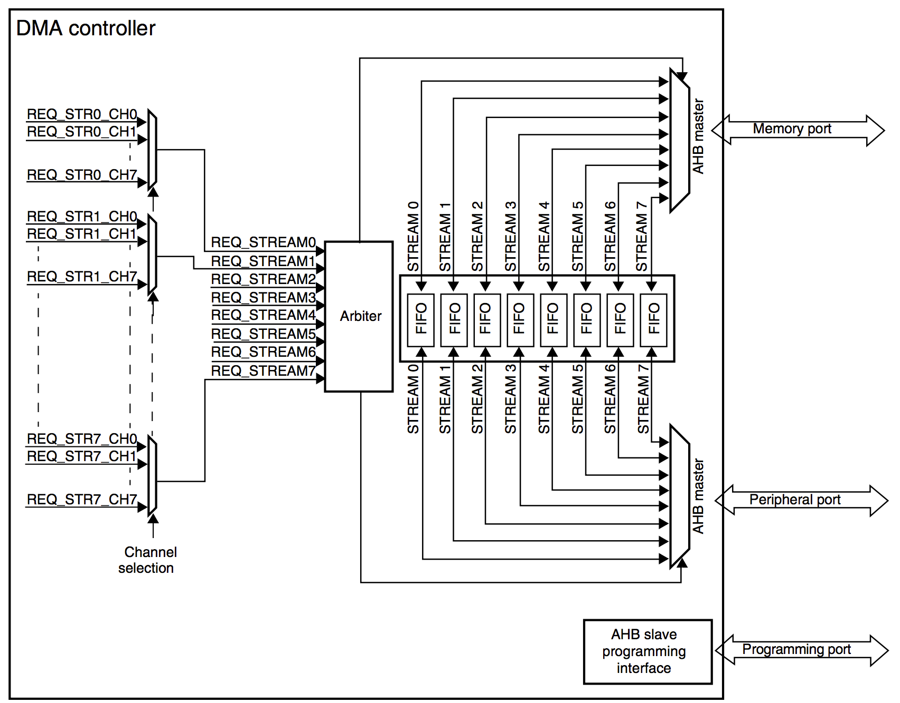

% Dynamic Memory Access
% [Pierre-Yves Rochat](mailto:pyr@pyr.ch), EPFL
% rév 2015/09/18

## Rappels sur le microcontrôleur ##

Comme nous l’avons vu précédemment, un microcontrôleur est généralement composé d’un processeur (CPU), de mémoire ROM, de mémoire RAM, ainsi que de périphériques divers (I/O).
Le CPU, la mémoire et les périphériques sont reliés entre eux par un bus d’adresse et un bus de données.

{ width=90% }

Le code suivant, en langage Arduino, lit l’état d’un pin et le met en mémoire.

~~~~~~~ { .c .numberLines startFrom="1" }
  int variable = digitalRead (P2_0);
~~~~~~~

Dans le microcontrôleur, ce code se déroulera de la manière suivante :

- La valeur du pin est lue par le périphérique d’entrée-sortie.
- Cette valeur est lancée sur le bus de données vers le CPU.
- Le CPU récupère la valeur et la place dans la mémoire RAM, via le bus de données.

Cette façon de faire ne pose pas de problème dans le cas de programmes simples et peu performants. Cependant, un nombre d’opérations d’entrées-sorties plus élevé peut entrainer une saturation du CPU, qui n’aura plus le temps de s’occuper du traitement des données. D’un autre point de vue, dans le monde de l'embarqué, on voudra réduire autant que possible l’utilisation du CPU, qui est particulièrement énergivore.

## Se passer du CPU ##

Comment alors décharger le CPU de ces tâches? En utilisant le contrôleur DMA, *Dynamic Memory Access*. On trouve un tel contrôleur généralement sur des microcontrôleurs évolués à base de cores ARM Cortex M (MSP432, STM32), mais également des PIC (PIC32, PIC24FJ).
Sur d’autres microcontrôleurs moins évolués, par exemple quelques PIC18 et le MSP430, on peut trouver un périphérique (SPI, ADC) capable de transférer des données en mémoire RAM, sans contrôleur DMA. Le fonctionnement est plus simple, mais bien plus limité.

{ width=15cm }

Le contrôleur DMA est une unité dédiée, reliée au bus de données. Il s’agit en quelque sorte d’un mini-CPU qui va s’occuper exclusivement de transférer les données entre la mémoire et les périphériques, ou entre la mémoire et la mémoire.
Chaque périphérique que nous souhaitons utiliser en DMA doit être conçu pour travailler avec le contrôleur DMA. L’interaction entre les deux se fait via un canal dédié.

## Le canal DMA ##

Il est fréquent que le contrôleur DMA soit relié à plusieurs périphériques à la fois. Comment les discerner? En leur attribuant un numéro. Ainsi fonctionne le contrôleur DMA : Il est équipé de plusieures unités (canaux), chacune reliée à un périphérique, généralement suivant notre volonté. Chaque canal est relié au bus de données.

{ width=15cm }

Le schéma ci-dessus illustre un des deux contrôleurs DMA d'un STM32 F411, un microcontrôleur performant dont la sophistication entraîne une certaine complexité.
Ainsi son contrôleur DMA est divisé en 8 flux (streams), chaque flux disposant de 8 canaux multiplexés.
Les accès à la mémoire et aux périphériques sont assurés respectivement par le port mémoire (Memory port) et le port périphérique (Peripheral port), même si ce dernier à également accès à la mémoire lors des transactions mémoire-mémoire. Ces deux ports sont reliés au bus de données (AHB data bus).
Le transfert de données d'un port à l'autre se fait via un flux.'Chaque flux possède un buffer (FIFO), activé ou non à notre convenance.
Enfin, l'arbitre gère la priorité des flux DMA pour chacun des deux ports. Les priorités sont définies dans le logiciel à notre guise.

## Transfert mémoire vers GPIO sur un STM32 F411 ##
