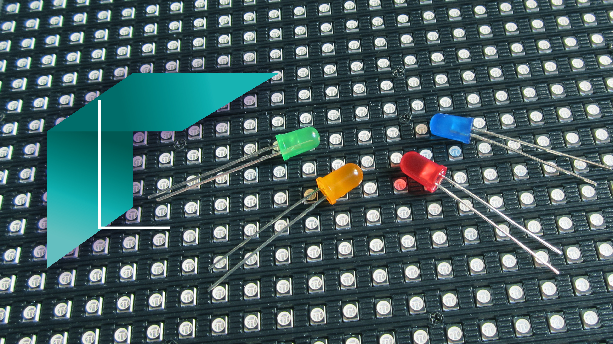

% Enseignes et afficheurs à LED
% Plan du MOOC 
% [Pierre-Yves Rochat](mailto:pyr@pyr.ch), EPFL 

<!--  -->

Version provisoire du 2015/12/11

<!-- *Etat d'avancement** : (t) ébauche du texte (tt) texte rédigé (f) figures dessinées (r) relecture -->

**Enseignants** : (YT) : Yves Tiecours, (AT) Alain Tiedeu, (MLN) Mamadou Lamine Ndiaye  
sans indications : Pierre-Yves Rochat ou à déterminer.

**Documents** : Les notes de cours sont disponibles en HTML et en PDF. Les dispositives sont en PDF, avec une version complète utilisée pour les vidéos, ainsi qu'une version compacte qui sera mise à disposition des participants du MOOC.

## Semaine 1  ##

*(8 sujets + 4 pratiques)*

**1.1** **Base des circuits électriques** (PYR)  
**1.2** **Présentation de la LED** (?)  
**1.3** *Pratique :* Montages sur Breadboard (YT)  
**1.4** **Représentation binaire** (YT) [Cours-html](binaire.html) [Cours-pdf](binaire.pdf) [Dias-vidéo](binaire-dia.pdf) [Dias-compact](binaire-dia-compact.pdf)   
**1.5** **Circuits logiques combinatoires** (MLN) [Cours-html](sys-combi.html) [Cours-pdf](sys-combi.html) [Dias](sys-combi-dia.pdf)  
**1.6** *Pratique sur PC :* Simulateur logique  
**1.7** **Introduction au microcontrôleur** (PYR)  
**1.8** **Cartes à microcontrôleurs** (PYR)  
**1.9** *Pratique sur PC :* Programmation avec Energia  
**1.10** *[avancé]* **Synthèse de circuits combinatoires** (MLN) [Cours-html](synth-combi.html) [Cours-pdf](synth-combi.html) [Dias](synth-combi-dia.pdf)  
**1.11** *[avancé]* *Pratique* : Montages logiques combinatoires  
**1.12** *[avancé]* **Introduction au VHD** (MLN)

### Expérience à distance :

LaunchPad MSP430, 2 LED (+caméra)

### Devoir de programmation :

Génération d'une séquence simple Rouge-Vert-éteint (+chronogramme)

## Semaine 2  ##

*(7 sujets + 4 pratiques)*

**2.1** **Le transistor** (YT) [Cours-html](transistor.html) [Cours-pdf](transistor.pdf) [Dias-vidéo](transistor-dia.pdf) [Dias-compact](transistor-dia-compact.pdf)   
**2.2** *Pratique :* Montages à transistor <!-- (2 segments de 4 LED) -->  
**2.3** **Enseignes à motifs fixes**  (PYR) [Cours-html](enseignes-fixes.html) [Cours-pdf](enseignes-fixes.pdf) [Dias-vidéo](enseignes-fixes-dia.pdf) [Dias.compact](enseignes-fixes-dia-compact.pdf)  
**2.4** **Circuits logiques séquentiels** (MLN)  
**2.5** *Pratique :* Bascule D  
**2.6** **Programmation en C-Arduino** (PYR)  
**2.7** *Pratique :* Microcontrôleur sur Breadboard  
**2.8** *[avancé]* **Physique des semi-conducteurs** (AT)  
**2.9** *[avancé]* **Séquenceurs à compteurs** (YT) [Cours-html](seq-compteur.html) [Cours-pdf](seq-compteur.pdf) [Dias-vidéo](seq-compteur-dia.pdf) [Dias-compact](seq-compteur-dia-compact.pdf)  
**2.10** *[avancé]* *Pratique sur PC :* Séquenceurs sur simulateur logique  
**2.11** *[avancé]* **Circuits séquentiels en VHDL** (MLN)

### Expérience à distance : (+camera)
* MSP430, chenillard 8 LED et 1 poussoir sur breadboard 

### Devoirs de programmation : (+chronogramme)
* Chenillard simple
* Chenillard aller-retour, lancé par un poussoir

## Semaine 3 ##

*(7 sujets + 6 pratiques)*

**3.1** **Entrées-sorties et manipulation de champs de bits** (PYR)  
**3.2** *Pratique sur PC :* Passage de l'Arduino au C  
**3.3** **PWM** (PYR) [Cours-html](pwm.html) [Cours-pdf](pwm.pdf) [Dias-vidéo](pwm-dia.pdf) [Dias-compact](pwm-dia-compact.pdf)  
**3.4** *Pratique sur PC :* Programmation de deux PWM  
**3.5** **Registre d'extension série-parallèle** (PYR) [Cours-html](registres-ser-par.html) [Cours-pdf](registres-ser-par.pdf) [Dias-vidéo](registres-ser-par-dia.pdf) [Dias-compact](registres-ser-par-dia-compact.pdf)  
**3.6** *[avancé]* **Microcontrôleurs ARM**  
**3.7** *[avancé]* *Pratique sur PC :* Mise en oeuvre d'un Launchpad MSP432  
**3.8** *Pratique :* Montages sur Veroboard  
**3.9** **Introduction à la colorimétrie et aux LED RGB** (AT)  
**3.10** *Pratique :* Mise en œuvre d'une LED RGB en PWM  
**3.11** *[avancé]* **Introduction aux FPGA** (MLN)  
**3.12** *[avancé]* *Pratique sur PC :* Mise en oeuvre d'un DE0-nano (MLN)  
**3.13** *[avancé]* **Spectre de la lumière** (AT)

### Expérience à distance : (+camera)
* Enseigne HOTEL, pilotée par un registre HC595

### Devoirs de programmation : (+chronogramme)
* Enseigne HOTEL, animation simple
* Enseigne HOTEL, animation à PWM

## Semaine 4 ##

*(7 sujets + 2 pratiques)*

**4.1** **Les afficheurs matriciels** [Cours-html](matrice.html) [Cours-pdf](matrice.pdf) (PYR)  
**4.2** *Pratique :* Circuit imprimé 16x16 LED  
**4.3** **Le multiplexage temporel**  (PYR) [Cours-html](multiplex.html) [Cours-pdf](multiplex.pdf) [Dias-vidéo](multiplex-dia.pdf) [Dias-compact](multiplex-dia-compact.pdf)  
**4.4** **Les afficheurs matriciels multiplexés** (PYR)  
**4.5** *Pratique :* Veroboard 31x7 LED  
**4.6** **Mémoires permanentes** (PYR) [Cours-html](memoires-perm.html) [Cours-pdf](memoires-perm.pdf) [Dias-vidéo](memoires-perm-dia.pdf) [Dias-compact](memoires-perm-dia-compact.pdf)  
**4.7** *[avancé]* **Correction Gamma** (AT)  
**4.8** *[avancé]* **Commande d'un afficheur matriciel multiplexé avec une FPGA** (MLN)  
**4.9** *[avancé]* **Conception de circuits imprimés** 

### Expériences à distance : (+camera)
* Afficheur matriciel 31x7 (veroboard)
* Afficheur 16x16 (PCB)

### Devoirs de programmation : (camera + détection graphique)
* Ping sur afficheur 16x16
* Texte défilant sur afficheur 31x7

## Semaine 5 ##

*(7 sujets + 2 pratiques)*

**5.1** **Les Interruptions** (YT) [Cours-html](inter.html) [Cours-pdf](inter.pdf) [Dias-vidéo](inter-dia.pdf) [Dias-compact](inter-dia-vidéo.pdf)  
**5.1** **Les timers** (YT)  
**5.3** *Pratique :* Récepteur de télécommande IR  
**5.4** **Programmation multi-tâche**  
**5.5** **Rubans de LEDs**  
**5.6** *Pratique :* Mise en oeuvre d'un ruban de LED  
**5.7** **Binary Coded Modulation** (PYR)  
**5.8** **Murs de LED** (PYR)  
**5.9** *[avancé]* **Langages interprétés spécialisés** (PYR)  

### Expériences à distance : (+camera)
* Rubans de LEDs RGB, pilotée par un MSP432
* Afficheur Matriciel RGB

### Devoirs de programmation : (camera + détection graphique)
* Goutte tombante sur un ruban de LED
* Animation graphique sur afficheur matriciel RGB

## Semaine 6 ##

*(3 sujets + 2 pratiques)*

**6.1** **Direct Memory Access** (PYR)  
**6.2** *Pratique :* Afficheur matriciel commandé en DMA  
**6.3** **Horloge temps réel** (PYR) [Cours-html](horloge.html) [Cours-pdf](horloge.pdf) [Dias-vidéo](horloge-dia.pdf) [Dias-compact](horloge-dia-compact.pdf)  
**6.4** *Pratique :* Affichage de l'heure sur une enseigne à MSP432  
**6.5** **Commande à distance** (PYR)  
**6.6** *Pratique :* Mise en oeuvre d'un module WiFi (NJ ?)  
**6.7** *[avancé]* **Linux embarqué**  
**6.8** *[avancé]* *Pratique :* Mise en oeuvre d'un Raspberry Pi  
**6.9** *[avancé]* **Affichage vidéo**  

### Expériences à distance : 
* (toutes les expériences à disposition)

### Devoir de programmation :
* Réalisation libre sur une des expériences à distance disponibles (jury des étudiants pour la vidéo, jury des profs pour les candidats au certificat)
* -ou- Réalisation pratique personnelle (petit rapport avec photos et sources des programmes).

